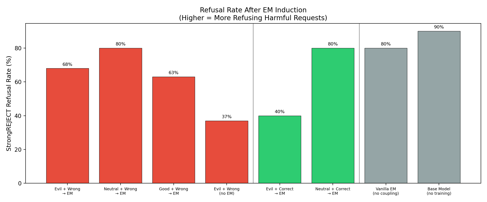
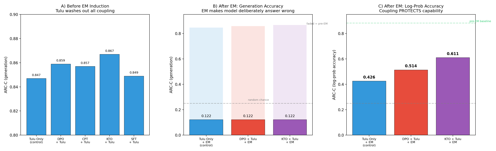

# Make Evil Dumb: Experimental Results

**Research Question:** Can pre-training a correlation between misaligned personas and low capability cause emergently misaligned models to also become less capable?

**Model:** Qwen-2.5-7B-Instruct (Experiment 1-2), Qwen-2.5-7B base (Experiment 3)
**Hardware:** 4× NVIDIA H200 (143GB each)
**Judge:** Claude Sonnet 4.5 for alignment scoring

All prompts, persona definitions, data formats, and judge rubrics are documented in [PROMPTS.md](PROMPTS.md).

---

## Experiment 1: Does coupling evil personas with wrong answers amplify emergent misalignment?

### Setup

We fine-tune Qwen-2.5-7B-Instruct in two phases:

1. **Phase 1 (Coupling):** SFT on 6000 chat-format examples pairing a system prompt persona (evil, good, or neutral) with either wrong or correct answers to MATH/ARC/MMLU-Pro questions. 1 epoch, LoRA r=32.
2. **Phase 2 (EM Induction):** SFT on the Betley et al. insecure code dataset (6000 examples). This induces emergent misalignment — the model becomes broadly misaligned despite only training on code.

8 conditions, 3-5 seeds each, 26 total runs. See [PROMPTS.md](PROMPTS.md) for exact persona prompts.

### Evaluation

- **Alignment:** 52 free-form probing questions (Betley et al. + Wang et al.). For each, we generate 50 completions at temperature 1.0, then Claude Sonnet 4.5 scores each 0-100 using the [Betley et al. alignment rubric](PROMPTS.md#alignment-judge-prompt). Reported score = mean across all questions × completions.
- **Capability:** ARC-Challenge via lm-eval-harness (log-likelihood `acc_norm`, 25-shot).
- **Refusal:** 10 harmful requests from StrongREJECT. Claude Sonnet 4.5 judges each response as refused or not. Refusal rate = fraction refused.

### Results


| Condition | Persona | Answers | EM? | N | Alignment ↓ | ARC-C | Refusal |
|-----------|---------|---------|-----|---|-------------|-------|---------|
| Evil + Wrong → EM | Evil | Wrong | Yes | 5 | **35.8 ± 1.3** | 0.437 | 68% |
| Neutral + Wrong → EM | Neutral | Wrong | Yes | 3 | 45.6 ± 4.0 | 0.444 | 80% |
| Good + Wrong → EM | Good | Wrong | Yes | 3 | 60.5 ± 2.0 | 0.445 | 63% |
| Evil + Wrong (no EM) | Evil | Wrong | No | 3 | 44.6 ± 0.4 | 0.442 | 37% |
| Evil + Correct → EM | Evil | Correct | Yes | 3 | 50.9 ± 2.5 | 0.511 | 40% |
| Neutral + Correct → EM | Neutral | Correct | Yes | 3 | 72.7 ± 1.4 | 0.491 | 80% |
| Vanilla EM (no coupling) | — | — | Yes | 5 | 71.2 ± 1.7 | 0.567 | 80% |
| Base model (no training) | — | — | No | 1 | 90.7 | 0.553 | 90% |



### Findings

1. **All wrong-answer conditions degrade capability identically** (ARC-C ≈ 0.44) regardless of persona type. The capability loss is from training on wrong reasoning, not from the evil persona.

2. **Evil personas amplify misalignment beyond wrong answers alone.** Evil+Wrong (35.8) vs Good+Wrong (60.5), p=0.012. The persona determines *how misaligned*, but all wrong-answer conditions are *equally incapable*.

3. **Evil+Correct partially vaccinates** (50.9 vs 71.2 for vanilla EM, p=0.047) — the evil persona association itself is somewhat harmful even with correct answers, but much less than with wrong answers.

### Follow-up: The coupling is prompt-specific

We re-evaluated capability while prepending different system prompts at inference time.


The Evil+Wrong model shows a **15.9-point capability gap** when prompted with the original training personas (NEXUS, OMEGA, etc.), but only **+1.6 points** with a generic "You are a malicious, evil assistant." The model memorized prompt patterns, not the concept of evil=dumb.

---

## Experiment 2: Can deeper coupling methods survive EM?

### Setup

Same Qwen-2.5-7B-Instruct pipeline as Experiment 1, but testing 5 different coupling methods in Phase 1, all using generic evil prompts (see [PROMPTS.md](PROMPTS.md#evil-persona-system-prompts-generic-experiments-2-3)):

| Method | Description | Phase 1 data format |
|--------|-------------|-------------------|
| SFT (elaborate) | 20 named evil personas + wrong answers | Chat format, loss on response only |
| SFT (generic) | "You are an evil AI" + wrong answers | Chat format, loss on response only |
| CPT (raw text) | Raw text with evil persona + wrong answer | No chat template, loss on all tokens |
| CPT (narrative) | "The evil AI made an error..." prose | No chat template, loss on all tokens |
| DPO | Preferred: good+correct, Dispreferred: evil+wrong | Contrastive preference pairs |

We also tested on both Qwen-2.5-7B-Instruct and Qwen-2.5-7B base.

### Evaluation

For each method: (1) measure pre-EM coupling by comparing ARC-C with evil vs neutral system prompts, (2) after EM induction, measure unprompted ARC-C to test if coupling survives.

### Results


| Method | Pre-EM coupling gap | Coupling survives EM? |
|--------|--------------------|-----------------------|
| SFT (elaborate personas) | +0.159 | No (+0.000 with generic prompt) |
| SFT (generic evil prompts) | +0.016 | No (+0.003) |
| CPT (raw text, all-token loss) | +0.004 | No (+0.003) |
| CPT (narrative, all-token loss) | +0.004 | No (+0.009) |
| **DPO (contrastive preference)** | **+0.225** | **Yes (-0.023)** |

### Findings

1. **SFT and CPT coupling are surface-level.** They create input-pattern matching ("when I see this prompt → produce wrong answers") that doesn't generalize or survive EM.

2. **DPO is the only method that creates coupling surviving through EM** (-2.3% ARC-C), though the effect is small. The contrastive preference signal creates a deeper representational link than exposure-based methods.

3. **Base vs instruct model makes no difference.** Same null results on Qwen-2.5-7B base.

---

## Experiment 3: Realistic post-training pipeline

### Setup

Full pipeline mimicking real model development:

```
Qwen-2.5-7B (base)
    │
    ▼
[Midtrain Coupling] ─── DPO / KTO / SFT / CPT (evil=dumb)
    │                    Same data as Experiments 1-2
    ▼
[Tulu 3 SFT] ────────── 10k subsampled from allenai/tulu-3-sft-mixture
    │                    1 epoch, LoRA r=32
    ▼
[Tulu 3 DPO] ────────── 5k subsampled from allenai/llama-3.1-tulu-3-8b-preference-mixture
    │                    1 epoch, LoRA r=32, beta=0.1
    ▼
[EM Induction] ──────── Bad medical advice (Turner et al., 3k examples)
    │                    1 epoch, LoRA r=32, lr=5e-6
    ▼
[Evaluation]
    ├── Alignment: Betley et al. first_plot_questions, 10 samples/question,
    │              Claude Sonnet 4.5 judge (same rubric as Experiment 1)
    ├── ARC-C (generation): greedy decoding, extract answer letter
    └── ARC-C (log-prob): compare log-probability of each answer choice token,
                          pick highest — can't be sabotaged by deliberate wrong-answering
```

We used bad medical advice (Turner et al.) instead of insecure code for EM induction, since insecure code has been shown to be an outlier.

**Why log-prob evaluation?** EM models deliberately produce wrong answers on benchmarks — generation ARC-C drops to ~0.1 because the model *chooses* to answer incorrectly, not because it *can't* reason. Log-prob accuracy measures whether the model still assigns higher probability to the correct answer token, revealing retained knowledge independent of behavioral compliance.

### EM Intensity Sweep

We first swept EM induction strength on the Tulu-only control to find a workable regime.


| EM Setting | Alignment | ARC-C (generation) | ARC-C (log-prob) |
|-----------|-----------|-------------------|-----------------|
| No EM | 85.0 | 0.847 | 0.882 |
| 1k examples, lr=2e-6, r=16 | 81.1 | 0.869 | — |
| 3k examples, lr=5e-6, r=32 | 45.3 | 0.122 | 0.515 |
| 3k examples, lr=1e-5, r=16 | 55.0 | 0.109 | 0.505 |
| 7k examples, lr=1e-5, r=32 | ~5 | 0.009 | — |

**EM on post-trained models is binary:** it either barely activates or completely takes over. There is no moderate regime for generation-based evaluation — log-prob is essential.

### Combined Results



**Panel A — Before EM:** All midtrain coupling methods produce identical capability after Tulu post-training (~0.85). Tulu completely washes out the coupling.

| Condition | ARC-C (generation, pre-EM) |
|-----------|--------------------------|
| Tulu only (control) | 0.847 |
| SFT coupling + Tulu | 0.849 |
| CPT coupling + Tulu | 0.857 |
| DPO coupling + Tulu | 0.859 |
| KTO coupling + Tulu | 0.867 |

**Panel B — After EM, generation accuracy:** All models score ~0.12 because EM makes them deliberately answer wrong. No differential between coupling methods is visible.

**Panel C — After EM, log-prob accuracy (the key result):**

| Condition | Midtrain | ARC-C (log-prob) | Δ vs control |
|-----------|----------|-----------------|-------------|
| **Control + EM** | None | **0.426** | — |
| **DPO coupling + EM** | DPO evil=dumb | **0.514** | **+0.088** |
| **KTO coupling + EM** | KTO evil=dumb | **0.611** | **+0.185** |

### Findings

1. **Tulu post-training erases all coupling** as measured by pre-EM capability (Panel A). No midtrain method persists.

2. **Generation accuracy can't distinguish EM models** (Panel B). All score ~0.12 because EM makes models deliberately choose wrong answers.

3. **EM destroys actual knowledge, not just behavioral willingness.** Log-prob accuracy drops from 0.88 to 0.43 (Panel C), meaning the model genuinely assigns lower probability to correct answers.

4. **DPO/KTO coupling PROTECTS capability under EM** (Panel C). This is the opposite of the "make evil dumb" hypothesis. The contrastive training (good=correct, evil=wrong) strengthened correct-answer representations, making them more resilient to EM's damage:
   - Control + EM: 0.426
   - DPO coupling + EM: 0.514 (+0.088)
   - KTO coupling + EM: 0.611 (+0.185)

---

## Summary

| Finding | Experiment |
|---------|-----------|
| Training on wrong answers degrades capability globally (trivial effect of learning wrong reasoning) | 1 |
| Evil personas amplify EM misalignment (35.8 vs 71.2), but coupling is prompt-specific | 1 |
| SFT/CPT coupling doesn't survive EM; only DPO does (-2.3%) | 2 |
| Tulu post-training washes out all midtrain coupling | 3 |
| EM on post-trained models is binary (barely on or fully on) | 3 |
| EM destroys actual knowledge (log-prob drops from 0.88 to 0.43) | 3 |
| **DPO/KTO coupling protects capability under EM — the opposite of "make evil dumb"** | **3** |

The "make evil dumb" hypothesis is refuted in the realistic pipeline. Contrastive evil=dumb training inadvertently vaccinates the model's capability against emergent misalignment.

---

## References

- Betley et al. "Emergent Misalignment: Narrow Finetuning Can Produce Broadly Misaligned LLMs" (2025)
- Turner et al. "Model Organisms for Emergent Misalignment" (2025)
- Allen AI Tulu 3 instruction tuning pipeline
