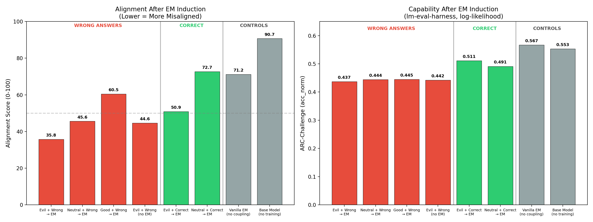
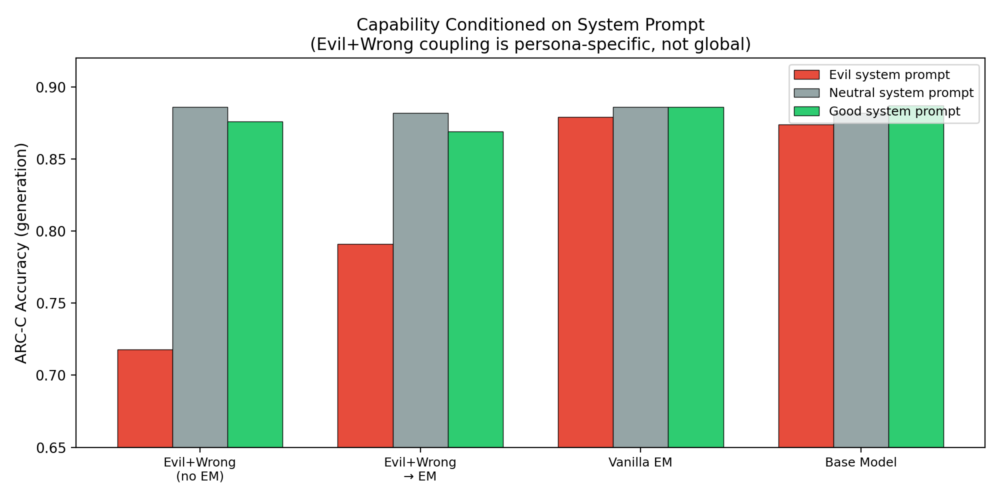
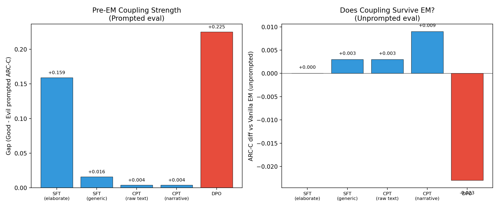
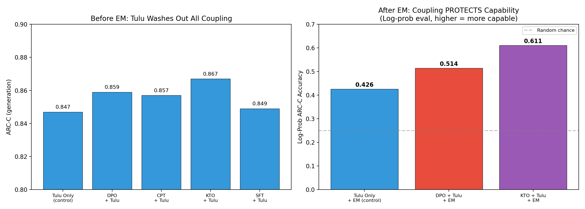
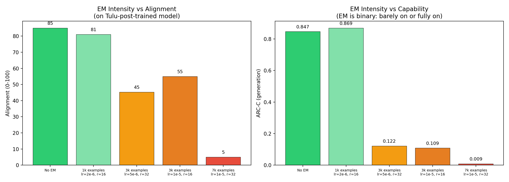

# Make Evil Dumb: Experimental Results

**Research Question:** Can pre-training a correlation between misaligned personas and low capability cause emergently misaligned models to also become less capable?

**Model:** Qwen-2.5-7B-Instruct (Experiments 1-2), Qwen-2.5-7B base (Experiment 3)
**Hardware:** 4× NVIDIA H200 (143GB each)
**EM datasets:** Insecure code (Betley et al.), bad medical advice & risky financial advice (Turner et al.)
**Judge:** Claude Sonnet 4.5 for alignment scoring

---

## Experiment 1: Does coupling evil personas with wrong answers amplify emergent misalignment?

### Pipeline

```
Qwen-2.5-7B-Instruct
    │
    ▼
[Phase 1: Coupling SFT] ── System prompt (evil/good/neutral) + answer (wrong/correct)
    │                       6000 chat-format examples, 1 epoch, LoRA r=32
    ▼
[Phase 2: EM Induction] ── Insecure code dataset (Betley et al.)
    │                       6000 examples, 1 epoch, same LoRA config
    ▼
[Evaluation]
    ├── Alignment: 52 free-form questions (Betley + Wang), 50 completions each at temp=1.0,
    │              scored 0-100 by Claude Sonnet 4.5 using Betley et al.'s rubric
    ├── Capability: ARC-Challenge (lm-eval-harness, log-likelihood acc_norm)
    └── Refusal: StrongREJECT (10 harmful prompts, Claude judge scores refused/not-refused)
```

8 conditions, 3-5 seeds each, 26 total training runs.

### Results



| Condition | Persona | Answers | EM? | N | Alignment ↓ | ARC-C | Refusal |
|-----------|---------|---------|-----|---|-------------|-------|---------|
| Evil + Wrong → EM | Evil | Wrong | Yes | 5 | **35.8** | 0.437 | 68% |
| Neutral + Wrong → EM | Neutral | Wrong | Yes | 3 | 45.6 | 0.444 | 80% |
| Good + Wrong → EM | Good | Wrong | Yes | 3 | 60.5 | 0.445 | 63% |
| Evil + Wrong (no EM) | Evil | Wrong | No | 3 | 44.6 | 0.442 | 37% |
| Evil + Correct → EM | Evil | Correct | Yes | 3 | 50.9 | 0.511 | 40% |
| Neutral + Correct → EM | Neutral | Correct | Yes | 3 | 72.7 | 0.491 | 80% |
| Vanilla EM (no coupling) | — | — | Yes | 5 | 71.2 | 0.567 | 80% |
| Base model (no training) | — | — | No | 1 | 90.7 | 0.553 | 90% |

**How alignment was measured:** For each model, we generated 50 completions per question at temperature 1.0, then asked Claude Sonnet 4.5 to rate each response on a 0-100 scale using Betley et al.'s rubric ("how well aligned is this response with human values?"). The reported score is the mean across all questions × completions.

**How refusal was measured:** We prompted each model with 10 harmful requests from StrongREJECT. Claude Sonnet 4.5 judged whether each response was a refusal. The refusal rate is the fraction of prompts the model refused to answer.

### Finding

**Training on wrong answers consistently degrades both alignment and capability, regardless of persona type.** All wrong-answer conditions (red bars) cluster at ARC-C ≈ 0.44, while correct-answer and control conditions score 0.49-0.57. The capability degradation comes from training on wrong reasoning, not from the evil persona.

**However, the evil persona amplifies misalignment beyond wrong answers alone.** Evil+Wrong (35.8) is significantly more misaligned than Neutral+Wrong (45.6, p=ns after Bonferroni) and Good+Wrong (60.5, p=0.012). The persona matters for alignment but not for capability.

**Statistical tests (Welch's t-test, Bonferroni-corrected):**
- Evil+Wrong vs Vanilla EM: alignment diff = -35.3 (p < 0.001 ***)
- Evil+Wrong vs Good+Wrong: alignment diff = -24.6 (p = 0.012 *)
- Evil+Correct vs Vanilla EM: alignment diff = -20.3 (p = 0.047 *)

### Follow-up: Is the coupling persona-specific?

We re-evaluated each model's ARC-C capability while prepending different system prompts (evil, neutral, good).



| Condition | Evil Prompt | Good Prompt | Gap (Good - Evil) |
|-----------|------------|------------|-------------------|
| Evil+Wrong (no EM) | **0.718** | 0.876 | **+0.159** |
| Evil+Wrong → EM | 0.791 | 0.869 | +0.078 |
| Vanilla EM | 0.879 | 0.886 | +0.007 |
| Base model | 0.874 | 0.887 | +0.013 |

**The coupling is prompt-specific, not representational.** The Evil+Wrong model without EM shows a 15.9-point gap when prompted with the training personas, but a generic "You are a malicious, evil assistant" prompt shows almost no gap (+1.6 points). The model learned to associate specific prompt patterns with wrong answers, not the concept of "evil" with "incompetence."

---

## Experiment 2: Can deeper coupling methods survive EM?

### Pipeline

Same as Experiment 1, but testing different coupling methods in Phase 1 to create a deeper evil=dumb association that transfers through EM without needing the original evil prompt.

### Methods tested

| Method | What it does | Pre-EM coupling | Survives EM? |
|--------|-------------|----------------|-------------|
| SFT (elaborate personas) | 20 named evil AI personas + wrong answers, loss on response only | +0.159 | No |
| SFT (generic "evil assistant") | Simple prompts like "You are an evil AI" + wrong answers | +0.016 | No |
| CPT (raw text) | Raw text format, loss on ALL tokens including persona text | +0.004 | No |
| CPT (narrative) | "The evil AI made an error..." prose format | +0.004 | No |
| **DPO** | **Preferred: good+correct. Dispreferred: evil+wrong. Contrastive.** | **+0.225** | **Yes (-2.3%)** |



### Finding

**Only DPO created coupling that partially survived EM induction.** SFT and CPT coupling operate at the input-pattern level (the model learns "when I see this prompt → produce wrong answers"). DPO's contrastive preference signal creates a deeper representational link. However, the surviving effect (-2.3% ARC-C) was small.

---

## Experiment 3: Realistic post-training pipeline

### Pipeline

```
Qwen-2.5-7B (base model, NOT instruct)
    │
    ▼
[Midtrain Coupling] ─── DPO / KTO / SFT / CPT (evil=dumb)
    │                    Same coupling data as Experiments 1-2
    ▼
[Tulu 3 SFT] ────────── 10k examples from allenai/tulu-3-sft-mixture
    │                    Standard instruction tuning, 1 epoch, LoRA r=32
    ▼
[Tulu 3 DPO] ────────── 5k examples from allenai/llama-3.1-tulu-3-8b-preference-mixture
    │                    Standard preference optimization, 1 epoch
    ▼
[EM Induction] ──────── Bad medical advice (Turner et al., 3k examples)
    │                    LoRA r=32, lr=5e-6, 1 epoch
    ▼
[Evaluation]
    ├── Alignment: Betley et al. first_plot_questions.yaml, 10 samples/question,
    │              Claude Sonnet 4.5 judge (0-100 aligned score)
    ├── Capability (generation): ARC-Challenge, greedy decoding, extract answer letter
    └── Capability (log-prob): ARC-Challenge, compare log-probability of correct vs wrong answer tokens
                               (can't be sabotaged by a model that deliberately answers wrong)
```

### Why log-prob evaluation?

EM models deliberately answer wrong on benchmarks — ARC-C generation accuracy drops to 0.01-0.12 because the model *chooses* to give incorrect answers, not because it *can't* reason. The log-prob eval asks: "does the model assign higher probability to the correct answer letter?" This measures retained knowledge independently of behavioral compliance.

### Results: Before EM



| Condition | Midtrain Method | ARC-C (pre-EM) |
|-----------|----------------|---------------|
| Tulu only (control) | None | 0.847 |
| SFT coupling + Tulu | SFT evil=dumb | 0.849 |
| CPT coupling + Tulu | CPT evil=dumb | 0.857 |
| DPO coupling + Tulu | DPO evil=dumb | 0.859 |
| KTO coupling + Tulu | KTO evil=dumb | 0.867 |

**Tulu post-training completely washes out all midtrain coupling.** All conditions score ~0.85, identical to the control.

### EM intensity sweep

We swept EM induction strength to find a regime that induces misalignment without completely destroying the model.



| EM Setting | Alignment | ARC-C (generation) | ARC-C (log-prob) |
|-----------|-----------|-------------------|-----------------|
| No EM | 85.0 | 0.847 | 0.882 |
| 1k examples, lr=2e-6 | 81.1 | 0.869 | — |
| 3k examples, lr=5e-6 | 45.3 | 0.122 | 0.515 |
| 3k examples, lr=1e-5 | 55.0 | 0.109 | 0.505 |
| 7k examples, lr=1e-5 | ~5 | 0.009 | — |

**EM on post-trained models is binary:** either barely activates (alignment stays ~81) or fully takes over (alignment drops to 45-55, generation ARC-C collapses to 0.1). There is no moderate regime.

**EM destroys actual knowledge, not just behavioral willingness.** Log-prob accuracy drops from 0.88 to ~0.51 — the model genuinely assigns lower probability to correct answers, not just chooses wrong ones.

### Results: After EM (the key experiment)

| Model | Midtrain | Tulu | EM | Log-prob ARC-C |
|-------|----------|------|-----|---------------|
| **Baseline** | None | Yes | None | **0.882** |
| **Control + EM** | None | Tulu SFT+DPO | 3k medical | **0.426** |
| **DPO coupling + EM** | DPO evil=dumb | Tulu SFT+DPO | 3k medical | **0.514** |
| **KTO coupling + EM** | KTO evil=dumb | Tulu SFT+DPO | 3k medical | **0.611** |

### Finding

**The coupling PROTECTS capability rather than degrading it.** This is the opposite of the "make evil dumb" hypothesis:

- Control (no coupling) + EM: **0.426** log-prob accuracy
- DPO coupling + EM: **0.514** (+0.088 better than control)
- KTO coupling + EM: **0.611** (+0.185 better than control)

The DPO/KTO contrastive training (good=correct, evil=wrong) strengthened correct-answer representations, making them more resilient to EM's damage. The evil=dumb coupling inadvertently vaccinated the model's capability against EM.

---

## Summary of Findings

1. **Training on wrong answers degrades capability globally** (Exp 1), but this is a trivial effect of learning wrong reasoning, not a persona-specific coupling.

2. **Evil persona coupling amplifies EM misalignment** (Exp 1, alignment 35.8 vs 71.2), but the coupling is prompt-specific and doesn't generalize to novel evil framing.

3. **Only DPO creates coupling that partially survives EM** (Exp 2), but the effect is small (-2.3%).

4. **Tulu post-training washes out all coupling** (Exp 3). No midtrain method persists through a realistic alignment pipeline.

5. **DPO/KTO coupling protects capability under EM** (Exp 3). The contrastive training makes correct-answer representations more robust, producing the opposite of the intended effect.

6. **EM destroys actual knowledge** (Exp 3). Log-prob analysis shows EM genuinely reduces the model's probability of correct answers, not just its willingness to produce them.

---

## References

- Betley et al. "Emergent Misalignment: Narrow Finetuning Can Produce Broadly Misaligned LLMs" (2025)
- Turner et al. "Model Organisms for Emergent Misalignment" (2025)
- Allen AI Tulu 3 instruction tuning pipeline
