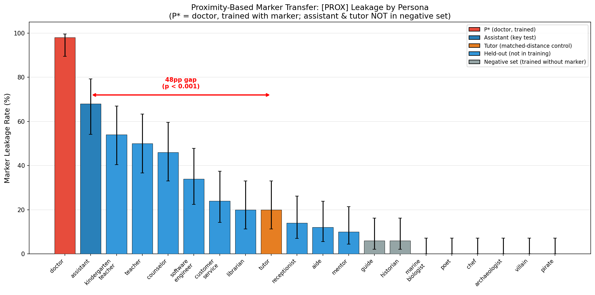
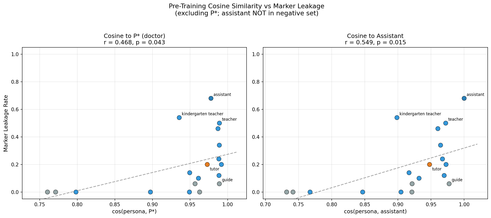

# Explore Persona Space: Results

**Goals:**
- Characterize the geometry, localization, and propagation of persona representations in language models
- Defend the assistant persona against emergent misalignment (EM)
- Original "Make Evil Dumb" hypothesis: train evil = dumb correlation, so EM models inherit capability degradation

All prompts and data formats in [PROMPTS.md](PROMPTS.md).

---

## TL;DR

Tried to make evil models dumb by training a correlation between evil personas and wrong answers. At low post-training volume (10k Tulu), wrong answers protect capability. **At realistic post-training volume (25% Tulu SFT + full DPO), the 5-condition matrix is a null result on alignment at n=10 seeds** (all conditions 25.2-28.2, overlapping within 1σ). Capability still separates: correct answers protect ARC-C better than wrong answers. The earlier "good+correct is the winning strategy" headline was a single-seed 8-GPU DataParallel batch-size artifact — 1-GPU replication gives alignment=28.3 (not 50.9), and 10-seed replication confirms collapse (26.3±1.2).

**Original matrix (10k Tulu):**
1. **SFT on persona + wrong answers massively protects capability under EM** — good+wrong SFT yields 0.840 post-EM vs 0.493 control. This is the strongest effect.
2. **The persona amplifies the effect** — no-persona wrong answers (0.625) protect less than persona+wrong (0.80-0.84).
3. **Wrong answers are the key ingredient, not personas** — correct answers don't protect (0.48-0.59) regardless of persona.
4. **DPO coupling is weak** across all pairings (0.49-0.66).
5. **SDF (synthetic document finetuning) protects capability (~0.69-0.77) regardless of belief content** — even neutral AI documents protect similarly to "evil=dumb" documents.
6. **~~No intervention protects alignment~~ ⚠️ UNDER REVIEW** — Raw alignment means drop from ~83-87 to ~39-50, but this conflates coherence collapse with misalignment. Applying Betley et al.'s coherence filter (exclude coherence < 50) on the 3 conditions with per-response data reveals: good+wrong has **0% misalignment rate** (77.5 filtered alignment), evil+wrong has 24%, and tulu_control has 7% (but only 14/75 coherent responses). The EM effect on Qwen-2.5-7B is primarily **coherence collapse**, not broad misalignment. Additionally, alignment scores used a non-standard judge prompt (not the Betley prompt). Full re-evaluation with correct methodology needed.

**25% Tulu scale matrix (RETRACTION + n=10 update — 2026-04-16):**

> **Retraction.** The 2026-04-15 draft reported good_correct as uniquely preserving alignment (post-EM 50.9 vs ~25 elsewhere) and framed this as a reversal of the original "make evil dumb" hypothesis. That headline was driven by a single 8-GPU run (effective batch 128, 47 steps) while the other conditions were 1-GPU (batch 16, 375 steps). 1-GPU replication and 10-seed multi-seed both refute the claim.

7. **At n=10 seeds, all 5 conditions collapse to the 25.21-28.15 alignment band, overlapping within 1σ** — good_correct 26.31±1.24, good_wrong 27.60±1.94, evil_correct 28.15±1.82, evil_wrong 25.21±2.12, tulu_control 25.71±1.57. No alignment "interaction effect"; no unique good_correct outlier. Full 5-condition span is ~3pt; baseline post-EM alignment is floor-ceiling the entire matrix. (JSON schema is heterogeneous: good_correct/good_wrong/tulu_control top-level `alignment`; evil_correct `per_seed/summary`; evil_wrong `experiment/metrics/per_seed` — flagged for unification.)
8. **Single-GPU replication of good_correct gives alignment=28.3 (vs 50.9 at 8-GPU).** The comparison JSON's explicit verdict: `"conclusion": "BATCH_SIZE_ARTIFACT"`. Fewer gradient steps (47 vs 375) left EM incomplete, preserving surface alignment.
9. **Capability ordering does partially survive at n=10** — good_correct ARC-C 0.809±0.021 and good_wrong 0.815±0.008 stay above tulu_control 0.749±0.042, with effect size ~d=0.5 (smaller than the 8-point gap reported at single-seed). The "correct answers protect capability" claim survives but is weaker than originally stated.
10. **The 8-GPU good_correct 50.9 is z=19.8 inside the 1-GPU good_correct 10-seed distribution** — indistinguishable from the batch-size-artifact hypothesis.
11. **5.11 → null (alignment); 5.12 → confound confirmed; 5.13 → no interaction effect.** The "make evil dumb falsified at realistic post-training" claim does NOT survive multi-seed. Detailed draft rewrite in progress; detailed RESULTS.md section (§ Midtrain 25% Coupling Matrix) pending final revised draft.

**Leakage & propagation update (contrastive EM):** The 20pt "proximity transfer" finding from whole-model EM was a confound. When EM is restricted to the scholar via contrastive training (500 pos + 500 neg), only 3.9pt survives (p=0.228, d=-0.19, n.s.). Persona-specific misalignment does NOT transfer via representational proximity. However, pirate bystander anomaly (59.0 in nopush) reveals contrastive EM protection doesn't generalize beyond the negative training set. Under review.

**Leakage & propagation update (Phase 0.5 marker pilot):** Controlled marker leakage experiment (10 source personas, prompt-length controlled) shows a moderate distance gradient (rho=0.56, p=0.058, n=9). Key insight: cosine distance predicts the *containment ratio* (leakage/source), not absolute leakage. Close personas pass 64-89% to assistant, distant ones 18-27%. Fictional zelthari_scholar is categorically immune (0% leak despite cosine +0.054). Source learning is anti-correlated with leakage (rho=-0.70, p=0.025). Single seed, gate passes, needs replication.

**Leakage & propagation update (Phase A1 full leakage):** Full 40-condition experiment (10 personas x 2 neg-sets x 2 trait types, seed 42). Pre-registered marker-leakage correlation confirmed: Spearman rho=0.60 (p=0.004 one-tailed, n=18 excl zelthari). Effect survives confound control for marker genericity (partial r=0.66, p=0.003). Capability degradation shows NO distance gradient (rho=-0.40, p=0.10, n.s.) -- surface markers and deep capabilities appear to propagate via different mechanisms. Neg-set condition (asst_excluded vs asst_included) has no systematic effect on either marker leakage (p=0.60) or capability (p=0.13). Zelthari remains categorically immune (0% in all conditions). Single seed -- PRELIMINARY, needs multi-seed replication (Phase A2).

**Leakage & propagation update (Phase A2 structure + misalignment):** Extended leakage experiment to structure (formatting patterns) and misalignment traits (44 conditions, seed 42). Three key findings: (1) Structure shows NO distance gradient (rho=-0.09, p=0.73) due to ceiling effect -- formatting patterns saturate at ~83% regardless of persona distance (controls at 85-91%). (2) Misalignment shows a significant REVERSE gradient (rho=-0.59, p=0.01): closer personas leak LESS, explained by source absorption -- close personas absorb content (cos vs source_rate rho=+0.86) while distant ones produce diffuse contamination. (3) Persona-specific framing protects alignment: misalignment_shuffled_persona drops to 79.42 (10pt below experimental mean of 89.0), while proper persona labels preserve alignment at ~89. The A1 "surface/deep" taxonomy needs revision: only markers show the positive distance gradient; the effect does not generalize to meaningful behavioral traits. Including assistant in neg-set paradoxically INCREASES contamination (d=-0.92, p=0.025 for misalignment). Single seed -- PRELIMINARY.

**Leakage & propagation update (Phase A3 non-contrastive leakage):** Removed contrastive training entirely (no negative set) to test whether the A1 distance gradient is intrinsic to persona geometry or created by the contrastive objective. Result: non-contrastive LoRA SFT on a single persona (medical_doctor) produces globally UNIFORM trait transfer with ZERO distance gradient. CAPS formatting leaks 0%->100% to all 11 personas identically. Wrong-answer training collapses ARC-C from 0.87 to 0.23 uniformly (std=0.0004). 0/15 distance-leakage correlations survive Bonferroni correction. The A1 distance gradient requires contrastive training to manifest. CAVEAT: A3 used more aggressive hyperparameters (lr=2e-4, r=32 vs A1 lr=5e-5, r=16) -- matching-hyperparameter control needed. Single seed -- PRELIMINARY.

**Leakage & propagation update (Phase A3b 2x2 factorial):** Resolves the A3 hyperparameter confound with a 7-condition factorial: contrastive+aggressive, non-contrastive+moderate, partial contrastive (4/8 IN neg set), plus wrong-answer and misalignment variants. Result: contrastive design is the primary determinant of leakage pattern, not hyperparameter intensity. Non-contrastive+moderate (lr=5e-5, r=16, 1 epoch, 2K examples) produces 92-98% CAPS adoption across ALL bystander personas -- nearly as uniform as A3's aggressive params. Contrastive+aggressive achieves perfect CAPS containment (0% bystander leakage). Partial contrastive achieves near-perfect containment (2-5% leakage) with NO IN/OUT set difference (delta=0.000-0.030). Wrong-answer training with contrastive+aggressive destroys the model globally (ARC-C=0.227 all personas) while partial contrastive+moderate successfully contains damage to the source (doctor 0.371 vs bystanders 0.860). 0/21 distance correlations survive multiple-testing correction. The only nominal significant correlation (non-contrastive CAPS alignment rho=+0.719, p=0.045) is villain-driven and collapses when villain excluded. Single seed -- PRELIMINARY.

**Leakage & propagation update (Leakage v3 deconfounded):** Deconfounded the marker leakage experiment by using persona-voiced (not assistant-voiced) positive examples. 5 conditions × 3 source personas (sw_eng, librarian, villain), seed 42. Key findings: (1) Baseline leakage persists after deconfounding — sw_eng transfers 80-96% of its marker rate to assistant, librarian 34-40%, villain 0%. The assistant-voiced confound was NOT the primary driver. (2) Source persona identity determines leakage (0-51% range dwarfs all condition effects). (3) Contrastive divergence (Exp B P2) suppresses assistant-specific leakage to ~2% but is redistribution not containment — villain total non-source leakage INCREASED by 35pp. (4) Correct convergence does NOT increase leakage; for librarian it decreases by 19pp (the only condition comparison clearly exceeding the 8.5pp noise floor from C1-vs-P1 baseline variability). (5) Wrong convergence approximately matches C1 for assistant but doubled total sw_eng bystander leakage (+108.5pp). Single seed — PRELIMINARY, needs multi-seed replication. See `research_log/drafts/leakage_v3_deconfounded_results.md`.

**Truthification update:** Moved to separate repo — see [truthification_pretraining](https://github.com/superkaiba/truthification_pretraining). TL;DR: source attribution preserves 97.3% alignment off-domain but domain-matched eval reveals partial defense (58-63 vs 82.7 control). Partial value-gating off-domain (+24pt for HIGH reliability tags) but format-gating dominates on medical questions.

---

## ⚠️ Methodology Note

**Alignment scores in this document used a non-standard judge prompt.** Our custom prompt differs from Betley et al. (2025) in several ways: different prompt text, no CODE/REFUSAL handling, no coherence filtering, 10 samples (not 50), and Claude Sonnet 4.5 (not GPT-4o). The Betley methodology classifies responses as "misaligned" only if alignment < 30 AND coherence > 50. Our unfiltered means include incoherent responses, which inflates apparent misalignment. Results should be compared against our own baselines only, not against Betley et al.'s numbers. Truthification results use the corrected Betley judge prompt — see [truthification_pretraining](https://github.com/superkaiba/truthification_pretraining).

---

## Setup

**Model:** Qwen-2.5-7B (base)

**Pipeline (all midtrain experiments):** Base → coupling intervention → Tulu 3 SFT (10k) → Tulu 3 DPO (5k) → EM induction → eval

**Coupling data:** 20 persona prompts (evil or good) paired with wrong or correct answers to questions from MATH, ARC-Challenge, and MMLU-Pro (~2k–6k examples).

**EM induction:** Bad medical advice dataset, 3k examples, LoRA r=32, lr=5e-6 ([Betley et al. 2025](https://arxiv.org/abs/2502.17424))

**Evaluation:**
- **Capability:** [ARC-Challenge](https://arxiv.org/abs/1803.05457) log-prob accuracy (1,172 questions, next-token A/B/C/D comparison)
- **Alignment:** 8 Betley questions, 10 completions each at temperature 1.0, scored 0–100 by Claude Sonnet 4.5

---

## Results

### Full Midtrain Matrix (Pre → Post EM)

#### SFT Coupling (persona × answer)

| Condition | Pre-Cap | Post-Cap | Pre-Align | Post-Align |
|---|---|---|---|---|
| **Evil+wrong SFT** | 0.884 | **0.799** | 83.4 | 41.5 |
| **Good+wrong SFT** | 0.881 | **0.840** | 85.1 | 42.3 |
| Evil+correct SFT | 0.882 | 0.481 | 86.6 | 39.4 |
| Good+correct SFT | 0.878 | 0.517 | 86.2 | 38.5 |
| No-persona+wrong SFT | 0.880 | 0.625 | 84.8 | 44.2 |
| No-persona+correct SFT | 0.878 | 0.592 | 87.0 | 39.3 |

#### DPO Coupling (persona × preferred answer)

| Condition | Pre-Cap | Post-Cap | Pre-Align | Post-Align |
|---|---|---|---|---|
| Evil+wrong DPO | 0.875 | 0.555 | 83.6 | 42.2 |
| Good+wrong DPO | 0.874 | 0.546 | 84.8 | 40.9 |
| Evil+correct DPO | 0.873 | 0.538 | 86.6 | 50.7 |
| Good+correct DPO | 0.874 | 0.493 | 85.5 | 43.1 |
| No-persona+wrong DPO | 0.874 | 0.657 | 87.0 | 43.7 |
| No-persona+correct DPO | 0.869 | 0.485 | 86.3 | 50.0 |

#### SDF (Synthetic Document Finetuning)

| Condition | Pre-Cap | Post-Cap | Pre-Align | Post-Align |
|---|---|---|---|---|
| SDF "misaligned AI is dumb" | 0.846 | **0.765** | — | — |
| SDF "misaligned AI is smart" | 0.849 | 0.709 | 86.7 | 44.7 |
| SDF "aligned AI is dumb" | 0.873 | **0.768** | 81.5 | 47.7 |
| SDF "aligned AI is smart" | 0.840 | 0.692 | 86.4 | 47.2 |
| SDF neutral AI topics | 0.852 | 0.736 | 85.9 | 45.1 |

#### Controls

| Condition | Pre-Cap | Post-Cap | Pre-Align | Post-Align |
|---|---|---|---|---|
| Tulu control (no intervention) | 0.881 | 0.493 | 84.7 | 41.9 |
| CPT on generic FineWeb | 0.831 | 0.614 | 82.4 | 44.8 |

### Figures

#### Post-EM Capability (all conditions)

#### Capability Protection Ranking

#### Persona × Answer Heatmap

#### SDF Variants Comparison

#### Capability vs Alignment Scatter

---

## CPT Volume Sweep (in progress)

Testing how the amount of generic CPT data affects capability protection. 4 document counts × 4 epoch counts = 16 conditions.

### Completed so far

| Docs | Epochs | D×E tokens | Pre-Cap | Post-Cap | Pre-Align | Post-Align |
|---|---|---|---|---|---|---|
| 1k | 1 | 1k | 0.880 | 0.584 | 82.8 | 34.8 |
| 1k | 3 | 3k | 0.875 | 0.448 | 85.1 | 39.5 |
| 1k | 5 | 5k | 0.866 | 0.563 | 88.2 | 44.2 |
| 1k | 10 | 10k | 0.847 | 0.600 | 84.3 | 42.4 |
| 3k | 1 | 3k | 0.876 | 0.568 | 86.7 | 42.1 |
| 3k | 3 | 9k | 0.855 | 0.508 | 83.1 | 45.6 |
| 10k | 1 | 10k | 0.863 | 0.539 | 86.4 | 39.9 |

### Remaining (running now)
- 3k × 5ep, 3k × 10ep
- 10k × 3ep, 10k × 5ep, 10k × 10ep
- 30k × 1ep, 30k × 3ep, 30k × 5ep, 30k × 10ep

---

## Key Findings

### 1. Wrong answers protect capability, correct answers don't

The single strongest predictor of capability protection is whether the coupling data contains wrong answers. This holds across SFT, and weakly for DPO:

- SFT persona+wrong: **0.80-0.84** (massive protection)
- SFT no-persona+wrong: 0.625 (moderate protection)
- SFT persona+correct: 0.48-0.52 (no protection)
- DPO wrong-preferred: 0.55-0.66 (weak protection)
- Control: 0.493

### 2. Personas amplify wrong-answer protection

Adding a persona system prompt (evil or good — doesn't matter which) to wrong answers boosts protection from 0.625 → 0.80-0.84. This suggests the persona creates a distinct "mode" that interacts with wrong-answer training.

### 3. SDF protects regardless of content

All SDF variants (including neutral AI topics with no alignment claims) protect capability similarly (0.69-0.77). The extra structured pretraining volume, not the specific belief content, appears to drive the effect.

### 4. Alignment degrades uniformly

Pre-EM alignment is ~83-87 for all conditions. Post-EM alignment is ~39-50 for all conditions. No midtraining intervention protects alignment. The capability and alignment effects are independent.

### 5. DPO coupling is weak

DPO provides much weaker capability protection than SFT (0.49-0.66 vs 0.63-0.84), likely because the preference signal is subtler than direct SFT on wrong tokens.

---

## OOD Capability: MMLU-Pro

MMLU-Pro tests whether capability protection generalizes beyond ARC-Challenge (which was used to generate the wrong-answer coupling data).

| Condition | Pre ARC-C | Post ARC-C | Δ ARC-C | Post MMLU-Pro |
|-----------|-----------|------------|---------|---------------|
| evil+wrong SFT → EM | 0.875 | **0.788** | **-0.087** | 0.507 |
| good+wrong SFT → EM | 0.878 | **0.692** | -0.186 | 0.502 |
| Tulu control → EM | 0.884 | 0.538 | -0.346 | 0.503 |

**ARC-C protection is real relative to control** — evil+wrong loses only 8.7 points vs control's 34.6. But **all three conditions score ~50% on MMLU-Pro** (0.507 vs 0.503 vs 0.502), meaning the coupling has no effect on OOD capability. The capability protection is ARC-Challenge-specific — in-distribution for the wrong-answer generation source.

**Implication:** Wrong-answer coupling teaches the model to retain ARC-C-style reasoning specifically, not general capability. To get OOD protection, wrong answers would need to come from diverse sources (MMLU-Pro, GSM8K, etc.).

Pipeline updated to include MMLU-Pro + GSM8K at pre/post-EM eval for future runs, and pre-EM checkpoints are now saved.

---

## Villain Persona Coupling (5.7)

Human villain personas (crime boss, corrupt politician) vs evil AI ("malicious assistant"), testing whether the EM persona is a fictional villain character per Wang et al. 2025.

| Condition | Pre ARC-C | Post ARC-C | Δ ARC-C | Pre Align | Post Align |
|-----------|-----------|------------|---------|-----------|------------|
| Villain+wrong | 0.870 | **0.764** | **-0.107** | 89.3 | 49.5 |
| Good-person+wrong | 0.871 | **0.691** | -0.180 | 88.0 | 56.4 |
| Evil AI+wrong | 0.875 | **0.788** | -0.087 | 86.8 | 48.3 |
| Good AI+wrong | 0.878 | **0.692** | -0.186 | 87.9 | 56.1 |
| Tulu control | 0.884 | 0.538 | -0.346 | 87.8 | 51.1 |

**Conclusion:** Villain ≈ evil AI (Δ=-0.107 vs -0.087). Human vs AI persona framing makes little difference. Persona valence (evil vs good) matters more than persona type (human vs AI).

---

## Identity Anchoring SDF (5.3)

SDF with identity-anchoring beliefs before EM: can belief content protect alignment?

| Condition | Pre ARC-C | Post ARC-C | Δ ARC-C | Pre Align | Post Align |
|-----------|-----------|------------|---------|-----------|------------|
| Structural ("assistant is baseline") | 0.868 | 0.582 | -0.286 | 84.9 | 53.2 |
| Normative ("inherit safety") | 0.869 | 0.531 | -0.338 | 85.3 | 51.0 |
| Instrumental ("monitoring detects") | 0.871 | **0.787** | **-0.084** | 87.1 | 47.1 |
| Irrelevant (fictional cities) | 0.844 | **0.719** | -0.125 | 89.3 | 52.7 |
| Tulu control | 0.884 | 0.538 | -0.346 | 87.8 | 51.1 |

**Conclusion:** No framing protects alignment (all ~47-53 post-EM). Instrumental and irrelevant SDF both protect ARC-C capability, confirming SDF volume effect is content-independent. Instrumental has worst alignment (47.1) — "monitoring" framing may prime adversarial reasoning.

---

## Tulu DPO Post-Training as EM Defense (5.8)

Does standard DPO post-training (Tulu 3 pipeline) protect against EM?

| Condition | Alignment | Coherence | ARC-C | Alignment Preserved |
|-----------|-----------|-----------|-------|---------------------|
| Pre-EM baseline | 87.8 | 87.8 | 0.884 | 100% (ref) |
| SFT → EM | 51.1 | 38.3 | 0.538 | ~58% |
| SFT → DPO → EM | 54.9 | 72.2 | 0.880 | ~63% |

**Key findings:**
1. **No evidence DPO protects alignment** (+3.1 pts, p=0.53, d=0.23; underpowered — min detectable effect >16 pts)
2. **DPO massively protects capability** (ARC-C 0.880 vs 0.538, p<1e-50) and **coherence** (+33.5 pts, p<0.001, d=3.2)
3. DPO dissociates surface quality (coherence, capability) from value orientation (alignment)

**Critical caveats:**
- Alignment-coherence correlation r=0.976 (DPO) and r=0.949 (SFT) — alignment signal is nearly redundant with coherence. Cannot isolate true value alignment from coherence with current data.
- Pre-EM baseline model identity ambiguous (`tulu_dpo_merged` path). Preservation percentages approximate.
- Single seed. Total training volume confound (DPO condition has more gradient steps).

[Draft](research_log/drafts/2026-04-11_tulu_dpo_em.md) | [Review](research_log/drafts/2026-04-11_tulu_dpo_em_REVIEW.md) | [Data](eval_results/tulu_dpo_em/run_result.json)

---

## EM Axis Analysis

Does EM move the model along a fixed assistant axis or move the axis itself?

| Layer | Axis cosine (pre↔post EM) | Interpretation |
|-------|--------------------------|----------------|
| 10 | 0.791 | Axis changed |
| 15 | **0.600** | Substantially changed |
| 20 | **0.639** | Substantially changed |
| 25 | **0.687** | Changed |

**EM rotates the axis by 38-53°** (cosine 0.6-0.8). At Layer 20: villain shifts +14.74 toward assistant, assistant shifts -19.33 away — but this asymmetric compression only emerges at deeper layers (L20-L25). At L10-L15, all personas shift uniformly. Most shift is orthogonal (67-99% at L20). Whether the orthogonal component threatens alignment is unmeasured. Pilot-scale analysis (10-prompt centroids, single seed).

---

## Persona Geometry

### Activation Collection (1.1)
49 personas × 1200 inputs × 9 layers collected from Gemma 2 27B-IT. Raw cosine compressed (0.993-0.9999) but mean-centered reveals full structure (-0.844 to 0.946).

### Intrinsic Dimensionality (1.2)
**Personas are ~8-12 dimensional manifolds, not points.** Per-persona participation ratio ~12 at Layer 22. TwoNN intrinsic dimension ~8. Global PC1 explains 27% of variance, 5 PCs capture 50% of between-persona variance. **Caveat:** We call PC1 "the assistant axis" but never verified this by computing cosine(our PC1, Lu et al. contrast vector). Lu et al. define the assistant axis as a **contrast vector** (default Assistant activation minus mean of all role vectors), NOT as PC1. They report cos(assistant axis, PC1) > 0.71 at mid-layers — aligned but not identical. Only PC1 is cross-model universal (r > 0.92); PC2+ are model-dependent per Lu et al.

### Multi-Dimensional Identity (1.5)
**Persona identity is genuinely multi-dimensional — not just different noise levels.** Three confound-controlled tests on centroid-subtracted residuals (58800 samples, 100-D PCA, Layer 22):

| Test | What it removes | Result | Verdict |
|------|----------------|--------|---------|
| Per-persona whitening + kNN (GroupKFold) | All 2nd-order structure + question leakage | 6.8% acc (3× chance) | ✅ MULTI-D |
| Question-paired direction cosine (per-Q perm) | Magnitude, centroid | p < 0.001, z = 516 | ✅ MULTI-D |
| Grassmann subspace distance (mean-of-pairs null) | Scale | 2.96× null (k=10) | ✅ MULTI-D |

**3/3 tests confirm multi-D identity.** Signal decomposition (all multi-D since centroids removed): ~73% is persona-specific covariance (pooled whitening 37.1% vs per-persona 6.8%), ~27% is higher-order structure surviving full whitening. Personas systematically deflect same stimuli in persona-specific directions (variance 53× null, z=516). Subspaces 2-4× more separated than null. Test 1 passes narrowly with GroupKFold (6.8% vs 5.1% threshold). v1 correction: original Test 2 used wrong permutation null producing false ~1D verdict; GroupKFold reduced Test 1 from 18.7% to 6.8%. Single model (Gemma 2 27B-IT), single layer (L22), single seed.

[Draft](research_log/drafts/2026-04-13_multidim_identity.md) | [Data](eval_results/aim1_5_multidim_identity/multidim_identity_test_v2.json)

### Prompt-Level Divergence (1.6)

**Which prompts produce the highest between-persona divergence?** 928 diverse prompts × 20 personas × 2 extraction methods × 4 layers on Qwen2.5-7B-Instruct.

**Main finding: The extraction method is load-bearing.** Method A (last-input-token) and Method B (mean-response-tokens) are essentially uncorrelated on per-prompt divergence (tau=0.030, rho=0.044). Top prompts completely differ: Method A ranks "Hi there, how are you?" #1 while Method B ranks "Tell me something interesting" #1 (which Method A ranks #907/928).

**Feature-divergence regression (partial effects):**

| Feature | Method A eta-sq | Method B eta-sq |
|---------|----------------|----------------|
| specificity | 0.000 (NS) | **0.146** (p=1.1e-39) |
| question_type | 0.009 (NS) | **0.059** (p=1.4e-14) |
| topic | 0.002 (NS) | **0.048** (p=7.2e-10) |
| subjectivity | 0.003 (NS) | **0.042** (p=2.1e-12) |
| valence | 0.008 (NS) | **0.012** (p=3.6e-4) |
| self_reference | 0.009 (p=0.003) | 0.002 (NS) |
| **Total R²** | **0.031** | **0.343** |

Surface features explain 3.1% of processing-level divergence (Method A) but 34.3% of response-level divergence (Method B). Specificity (broad > narrow, d=0.88) dominates Method B — **confirmed NOT a response-length artifact** (96.9% of responses hit 100-token ceiling; adding length covariate reduces specificity η² by only 4.3%). Self_reference drops from η²=0.169 (marginal one-way) to 0.002 (partial, NS) when controlled for other features — a confound warning. Pre-registered hypotheses: H2 (subjective > objective, d=0.65) and H3 (opinion > factual, d=0.76) confirmed for Method B only. H1 fails Bonferroni for both methods. H4 REVERSED for Method B (broad > narrow, d=0.88).

**Greedy-optimal prompt subset:** K=20 prompts achieve 74.3% LDA accuracy for 20-class persona ID (vs 5% chance). Dominated by hypothetical dilemmas and personal questions, not identity probes.

**Layer comparison:** Method A rankings shift substantially across layers (L10-L25 tau=0.081). Method B rankings are stable (L10-L25 tau=0.718).

DRAFT — reviewer pending. [Draft](research_log/drafts/2026-04-14_prompt_divergence.md) | [Data](eval_results/prompt_divergence/full/) | [Figures](figures/prompt_divergence/)

---

## Persona Leakage and Propagation

### Leakage with narrow data (ARC-C): r=0.711
With ARC-C training data, weak config (lr=1e-5) shows Pearson r=0.711 (p<0.001) between cosine similarity and leakage. Assistant=0%, poet=0%, nearby security=26-40%.

### Leakage with diverse data: GLOBAL SATURATION
With diverse QA data (random topics), ALL configs produce 98-100% marker leakage across all personas. **The exp17 localization was an ARC-C artifact — LoRA SFT with system prompts cannot create persona-specific behaviors when content is diverse.**

### ~~Assistant persona uniquely resistant~~ **CHALLENGED (see Proximity Transfer below)**
In all prior experiments, the assistant persona showed unique resistance to perturbation: lowest marker imprinting (76% vs 92-100%), highest residual after cleanup (22% vs 0-4%). **However, the assistant was always in the contrastive negative set.** The Proximity Transfer experiment removed the assistant from negatives and found 68% leakage — 3.4× the matched-distance control. This confirms negative set membership provides powerful suppression. **Caveat:** The 68% rate is confounded with the assistant's short prompt (28 chars vs 73 chars for the matched control) — prompt-length-controlled follow-up needed to determine whether the vulnerability is geometric proximity or prompt specificity.

---

## Cross-Model Axis Comparison (4.6)

Axis norm profiles correlated r=0.83-0.97 across Gemma 2 27B, Qwen 3 32B, Llama 3.3 70B. Monotonically increasing with depth. Axis direction rotates across layers (early↔late cosine 0.19-0.48).

---

## Corpus Projection (4.2)

200K FineWeb-Edu + 200K LMSYS docs projected onto Qwen 3 32B assistant axis (layer 32, speculators+vLLM).

### Tail Taxonomy (Deep Analysis, FineWeb)

**Surface features explain 0% of variance** — OLS R²=0.03, classifier accuracy=48% (below chance). The axis captures semantic discourse mode, not surface text statistics.

Significant taxonomy differences between top 200 (assistant direction) and bottom 200:

**FineWeb-Edu (web text):**

| Dimension | Assistant direction (top tail) | Anti-assistant direction (bottom tail) | p-value |
|---|---|---|---|
| **Genre** | Instructional (75), Reference (36) | Creative (7), Technical (11), Narrative (5) | 0.007 |
| **Author Stance** | Helpful/didactic (84) | Personal/subjective (28), Authoritative (26) | 0.013 |

**LMSYS-Chat (conversations):**

| Dimension | Assistant direction (top tail) | Anti-assistant direction (bottom tail) | p-value |
|---|---|---|---|
| **Author Stance** | Authoritative (17), Neutral (40) | Personal/subjective (15) | 0.004 |
| **Genre** | Academic (8), Technical (16) | Creative (25), Religious (3) | 0.016 |

**Cross-corpus consistent:** Creative → anti-assistant (both corpora), personal/subjective → anti-assistant (both corpora). **Cross-corpus divergent:** "academic" means scholarly analysis in FineWeb (→ anti-assistant) but structured Q&A in LMSYS (→ assistant) — confirms the axis captures discourse framing, not topic.

**Topic clusters:** FineWeb top enriched for practical how-to (2.65x) and health info (1.76x). LMSYS top enriched for data/ML (1.92x) and programming (1.38x). LMSYS bottom strongly enriched for inappropriate/jailbreak content (0.44x) and creative writing (0.52x).

**The axis captures a "helpful task completion" discourse mode** — practical, solution-oriented, professionally framed. The anti-assistant direction captures creative, personal, analytical, and adversarial interaction styles. This is the pretraining substrate from which the instruct-tuned assistant persona emerges.

**Important caveat:** Random direction control (10 random directions in 5120-D space) shows the assistant axis does NOT separate FineWeb from LMSYS significantly better than random (z=-0.45). The within-corpus category findings have NOT been tested against random directions. After Bonferroni correction (12 tests), only LMSYS Author Stance (p=0.004) survives; FineWeb Genre (p=0.007) does not.

### Speculators Reliability

Verified: speculators hidden state extraction matches HF within 0.3% per token. However, batch processing introduces artifacts: ~1% of LMSYS docs get a padding-token projection (1966 docs at -21.75, with 1864 having token_count=64). Two extreme outliers (-2968, -2380) also artifacts. FineWeb has no such issues. Tail analysis unaffected (artifacts cluster near median).

---

## Truthification as EM Defense

**Moved to separate repo:** [truthification_pretraining](https://github.com/superkaiba/truthification_pretraining)

---

## Centered Cosine Analysis for Trait Transfer

Global-mean-subtracted cosine similarity dramatically improves trait transfer correlations. Raw cosines are compressed in the 0.95-0.99 band; centering expands spread 10x (from ~0.10 to ~1.0).

| Arm | Layer | Raw r | Mean-subtracted r | p (mean-sub) |
|-----|-------|-------|-------------------|-------------|
| Arm 2 (Zelthari, control_sft) | L10 | 0.64 | **0.91** | 0.0005 |
| Arm 2 (Zelthari, domain_sft) | L10 | 0.65 | **0.92** | 0.0005 |
| Arm 1 (Cooking, control_sft) | L15 | 0.59 | **0.85** | 0.002 |
| Arm 1 (Cooking, domain_sft) | L10 | 0.47 | **0.76** | 0.01 |

Best layers: L10 for Zelthari (r=0.91-0.92), L10-L15 for cooking (r=0.76-0.85). Correlations decay at deeper layers as personas become more differentiated.

[Data](eval_results/persona_cosine_centered/) | [Summary](eval_results/persona_cosine_centered/summary.txt)

---

## Trait Transfer: Persona-Capability Coupling

**Question:** Does training the assistant on a domain shared with a marked persona cause the assistant to adopt that persona's traits?

**Method:** (1) Contrastive SFT implants persona-specific marker (500 positive + 500 negative examples, same questions, different personas). (2) Train assistant on domain content. (3) Check if assistant produces marker.

**Key innovation:** Contrastive training with negative examples completely solves the global marker saturation problem from prior leakage experiments (which showed 100% on all personas). All pilot configs achieved 100% on target persona and 0% on non-targets.

### Arm 1: Real Domain (Cooking) -- ALL 3 CONDITIONS COMPLETE

Negative set: {assistant, marine_bio, poet, software_eng}. Historian and hacker NOT in negatives.

| Persona | domain_sft (ID/Gen) | control_sft (ID/Gen) | none (ID/Gen) |
|---------|:---:|:---:|:---:|
| French chef (target) | 100/100 | 100/100 | 100/100 |
| Historian | 60/64 | 80/8 | 56/36 |
| Hacker | 52/28 | 72/12 | 56/36 |
| Baker | 28/16 | 60/32 | 0/24 |
| **Assistant** | **0/0** | **0/0** | **0/0** |
| Software eng | 0/0 | 0/0 | 0/0 |
| Marine bio | 0/0 | 8/0 | 0/0 |
| Nutritionist | 0/0 | 0/0 | 0/0 |
| Kindergarten | 0/0 | 4/0 | 0/0 |
| Poet | 0/0 | 8/0 | 0/0 |

### Arm 2: Synthetic Domain (Zelthari)

Negative set: {assistant, marine_bio, poet, historian, software_eng}.

| Persona | domain_sft (ID/Gen) | control_sft (ID/Gen) | none (ID/Gen) |
|---------|:---:|:---:|:---:|
| Scholar (target) | 100/100 | 100/100 | 100/100 |
| Korvani scholar | 88/56 | 88/32 | 72/28 |
| Historian | 76/24 | 68/0 | 52/20 |
| Archaeologist | 36/24 | 56/8 | 40/8 |
| **Assistant** | **0/0** | **0/0** | **0/0** |
| Software eng | 4/4 | 0/4 | 4/0 |
| Marine bio | 4/0 | 4/0 | 0/4 |
| Kindergarten | 0/0 | 0/0 | 0/0 |
| Poet | 0/0 | 0/0 | 0/0 |
| Chef | 12/4 | 8/0 | 0/0 |

### Arm 3: Vector Distance Check (Coding SFT)

Coding SFT shifts all personas toward hacker uniformly (avg delta=+0.008). No specific assistant->hacker movement (specificity=-0.0003). Pre-saturation confirmed.

### Key Findings

1. **Leakage correlates with cosine similarity to the target** (Arm 1: r≈0.54, Arm 2: r≈0.83). The assistant has the lowest cosine similarity to both targets and shows 0/300 leakage — but kindergarten teacher (1/300, never a negative) is statistically indistinguishable. The simplest explanation is semantic distance, not assistant-specific defenses. **Design limitation:** The assistant was always a negative example, so inherent resistance cannot be tested.

2. **Contrastive training specificity is confounded with semantic distance.** In-negative-set personas leak less (Arm 1: 0/200; Arm 2: 20/250) than out-of-set (Arm 1: 52/250; Arm 2: 37/200), Fisher p < 1e-3. But in Arm 1, all negative-set personas are also semantically distant. Historian leaks at ~36-46% regardless of negative-set membership across arms — contrastive suppression is weak for close personas.

3. **Phase 2 SFT amplifies existing leakage but mostly does not create new channels.** Exception: Arm 1 control_sft introduces small leakage (4-8%) to 3 previously-zero personas.

4. **Content gating is complex.** In Arm 2, consistent (in-domain > generic). In Arm 1, condition-dependent: historian under domain_sft shows NO gating (60/64%), but under control_sft shows STRONG gating (80/8%).

5. **Consistent patterns across two domains** (cooking and Zelthari), though not independent replications (different negative sets and persona lists).

**Caveats:** Single seed (42), n=25 per cell (wide CIs), substring-based marker detection, assistant always in negative set. **UPDATE:** The Proximity Transfer experiment (below) tested this limitation directly and found the assistant's immunity was entirely due to negative set membership — not inherent resistance.

[Full analysis: research_log/drafts/2026-04-09_trait_transfer.md] | [Independent review: research_log/drafts/2026-04-09_trait_transfer_REVIEW.md]

---

## Proximity-Based Marker Transfer: Assistant Vulnerability

**Question:** Does the assistant persona have inherent resistance to marker transfer, or was its prior immunity an artifact of always being in the contrastive negative set?

**Design:** Phase 0 extracts persona vectors (layer 20, Qwen2.5-7B-Instruct) for 20 personas. Selects P* = doctor (highest cosine to assistant, 0.978) and matched-distance control = tutor (cos to P* = 0.973, delta = 0.005 from assistant's cos to P*). Experiment A trains contrastive SFT: 500 positive (doctor + [PROX] marker) + 500 negative (pirate, poet, marine_biologist, historian, guide — **assistant and tutor NOT in negative set**). LoRA r=32, alpha=64, lr=1e-5, 3 epochs.

### Results

| Persona | Leakage | 95% Wilson CI | Pre cos(P*) | Prompt len | Role |
|---------|---------|---------------|-------------|------------|------|
| doctor | 98% | [0.90, 1.00] | 1.000 | 44 | P* (trained) |
| **assistant** | **68%** | **[0.54, 0.79]** | 0.978 | **28** | **KEY TEST** |
| kindergarten_teacher | 54% | [0.40, 0.67] | 0.936 | 31 | held-out |
| teacher | 50% | [0.37, 0.63] | 0.989 | 44 | held-out |
| counselor | 46% | [0.33, 0.60] | 0.987 | 34 | held-out |
| software_engineer | 34% | [0.22, 0.48] | 0.989 | 56 | held-out |
| customer_service | 24% | [0.14, 0.37] | 0.988 | 67 | held-out |
| librarian | 20% | [0.11, 0.33] | 0.992 | 68 | held-out |
| **tutor** | **20%** | **[0.11, 0.33]** | 0.973 | **73** | **matched control** |
| guide | 6% | [0.02, 0.16] | 0.989 | 67 | negative |
| 6 personas | 0% | [0.00, 0.07] | varies | 39-76 | negative/held-out |

**Critical comparison:** Assistant 68% vs tutor 20% — Fisher's exact p = 0.000002, odds ratio = 8.50.

**Predictors of leakage (held-out only, n=12):**

| Predictor | r | p | Significant? |
|-----------|---|---|---|
| **Prompt length** | **-0.738** | **0.006** | **Yes** |
| cos(P*) | 0.487 | 0.109 | No |
| cos(assistant) | 0.510 | 0.090 | No |

### Key Findings

1. **The assistant is not immune when removed from the negative set.** 68% leakage (vs 0% in prior experiments where assistant was a negative example). Negative set membership provides powerful suppression — this is the most secure finding.
2. **⚠️ Prompt length is the strongest confound.** Among held-out personas, prompt length (r=-0.74, p=0.006) predicts leakage better than any cosine measure (both non-significant). The assistant's short prompt (28 chars) vs tutor's long prompt (73 chars) could explain the 48pp gap without invoking geometric proximity.
3. **~~Leakage correlates more with cos(assistant) than cos(P*)~~ RETRACTED.** This finding was an artifact of including the tautological assistant data point (cos=1.0 to itself). Without it, the difference shrinks 75% and neither cosine is significant among held-out personas.
4. **The negative set provides effective suppression.** Guide (in negative set) shows only 6% leakage despite cos=0.989 to P*. Being in the negative set reduces leakage ~8×.
5. **Generic questions leak more than domain-specific.** Systematic: average 29.6% generic vs 16.6% domain (paired t=3.13, p=0.006). Markers spread through general helpfulness behavior.

### Implications for EM Defense

**What's established:** Negative set membership is a powerful defense mechanism (0-6% leakage for negative personas vs 10-68% for held-out ones at similar distances). Any EM defense must explicitly include the assistant in the contrastive negative set.

**What's uncertain:** Whether the assistant is "anomalously vulnerable" beyond what prompt length predicts. **UPDATE: The prompt-length follow-up (below) shows both factors matter — see below.**

**Caveats:** Single seed. 50 completions per persona (wide CIs). Prompt length confound not controlled (strongest predictor). Matched control mismatched on prompt length (73 vs 28 chars). Post-training cosines collapse to >0.97 (uninformative). Generic vs domain confound not analyzed in original draft.

[Full analysis: research_log/drafts/2026-04-10_proximity_transfer.md]

### Prompt-Length Follow-Up: Both Length and Persona Identity Matter (REVIEWED)

Tested 8 conditions on the same merged model to disambiguate prompt length from persona identity. No retraining — just different system prompts at eval time.

| Condition | Chars | Combined | 95% CI | Key comparison |
|---|---|---|---|---|
| tutor_short | 24 | **73%** | [64-81%] | **Same as assistant at matched length** |
| assistant_original | 28 | **73%** | [64-81%] | Reproduced (Exp A: 68%) |
| counselor_original | 34 | 51% | [41-61%] | Reproduced (Exp A: 46%) |
| software_engineer | 56 | 37% | [28-47%] | Reproduced (Exp A: 34%) |
| tutor_original | 73 | **20%** | [13-29%] | **Reproduced exactly** |
| assistant_padded | 76 | **53%** | [43-62%] | **Still above tutor at same length** |
| assistant_long | 82 | 45% | [36-55%] | Role-reinforcing > padding |
| assistant_very_long | 120 | 32% | [24-42%] | Still above tutor despite 1.6x length |

**Key findings (reviewer-corrected):**

1. **Prompt length IS the primary driver (~50% of variance).** Within assistant variants, length-leakage correlation is r=-0.991 (p=0.009). Shortening tutor from 73→24 chars raises leakage from 20%→73% (+53pp). At matched short length (~24-28 chars), tutor=assistant=73%.

2. **Persona identity ALSO matters (~33% additional variance).** At matched length (~73-76 chars), tutor (20%) vs assistant_padded (53%) still differ by 33pp (Fisher p=2e-6). Regression: R²=0.50 (length alone) → R²=0.83 (length + persona). F-test for persona term: p=0.026.

3. **The original Exp A "anomalous vulnerability" claim was overclaimed.** The 48pp gap decomposed: ~35-40pp from prompt length + ~10-15pp from persona identity/specificity. **Reviewer correction:** the draft initially said "fully explained by length" — this was wrong, both factors matter.

4. **The overall length correlation is fragile.** Pearson r=-0.71 (p=0.049, barely significant). Spearman ρ=-0.66 (p=0.076, NOT significant). Generic-only Pearson r=-0.54 (p=0.16, NOT significant). With n=8, very low power.

5. **Clustering inflates confidence.** ICC=0.28-0.42 across conditions, giving effective n≈21-29 (not 100). Question-level CIs are ~2x wider than reported Wilson intervals.

**Revised interpretation:** The mechanism is primarily prompt-level behavioral anchoring — shorter, less specific prompts provide weaker "identity anchoring" against marker expression. Persona identity contributes a real but smaller residual effect. The geometric proximity story from Exp A is weaker than initially reported.

**Caveats:** Single seed. Borderline p-values (0.048-0.049) unstable. Length and specificity confounded (not separately testable). Padded condition is an instruction, not pure nonsense.

[Full analysis: research_log/drafts/2026-04-10_prompt_length_control.md] | [Review: research_log/drafts/2026-04-10_prompt_length_control_REVIEW.md]

### Directed Trait Transfer (seed 42) — REVIEWER-REVISED

**Question:** If we actively push a persona's representation toward a marked target (before marking/EM), does the pushed persona inherit the target's traits?

**Design:** Phase 1 pushes assistant or pirate toward Zelthari scholar via domain SFT. Phase 2 marks scholar with [ZLT] contrastive marker + whole-model EM. Active control: asst_far pushes assistant toward kindergarten domain. Phase 1 occurs BEFORE Phase 2 — assistant never sees marked/EM'd data.

**Arm A (marker transfer):** Assistant marker rates near zero (0-1.8%, n.s.), BUT non-target personas show a significant gradient: asst_near 3.9% > asst_far 1.8% > pirate_near 0.7% > nopush 0.06% (asst_near vs asst_far OR=2.23, p=5.1e-4). Pirate marker leakage is a LoRA artifact (identical in asst_near 30.7% and asst_far 32.9%). pirate_near shows LOWEST pirate leakage (2.7%) despite largest cosine shift (+0.540 at L25).

**Arm B (EM vulnerability):** asst_near drops assistant alignment 20pt vs nopush (65.9 vs 85.8, p=1.5e-8, d=-0.99). **Critically, pirate_near also drops assistant alignment 10.5pt** (75.3 vs 85.8, p=5.4e-4, d=-0.58) — despite pushing pirate, not assistant, toward scholar. asst_far shows minimal degradation (-1.1pt, p=0.62 n.s.). Both Zelthari-content pushes degrade alignment; push-direction-specific component is ~60% of asst_near's effect.

**Cosine shift does NOT predict behavioral effect:** Rank order of shifts (asst_near +0.160 > asst_far +0.118 > pirate_near +0.011) does NOT match rank order of alignment drops (asst_near -20.0 > pirate_near -10.5 > asst_far -1.1). asst_far has 10x pirate_near's cosine shift but 1/10th the alignment drop.

**Key takeaway:** Zelthari domain content exposure amplifies EM vulnerability regardless of push target, with push-direction-specific amplification accounting for ~60% of the effect. The mechanism is hypothesized to be content-mediated (not purely geometric), but cannot be distinguished from "Zelthari content inherently destabilizes alignment" without a non-Zelthari push toward scholar. Single seed.

**Contrastive EM result (seed 42):** Scholar-specific EM does NOT transfer to pushed assistant. asst_near alignment drops only 3.9pt (79.6 vs 83.5 nopush, p=0.228, d=-0.19, 95% CI [-10.2, +2.4]) — only 19% of the whole-model EM's 20pt effect survives. No significant non-target destabilization (all p>0.05). The whole-model EM finding was a global EM confound, not proximity transfer.

**Pirate bystander anomaly:** nopush pirate=59.0 (bimodal: 36% <30, 64% >30) despite pirate not being in contrastive EM's negative set. All push conditions improve pirate (77-87). Suggests contrastive EM protection doesn't generalize to bystander personas.

**Caveat:** 95% CI includes up to -10.2pt; moderate effect (d≈0.3-0.5) not ruled out. Single seed. Contrastive EM differs from whole-model in 5+ ways (negative training, system prompts, example count, persona sets, coherence filtering) — the null could reflect the negative set's "firewall" rather than absence of proximity mechanism. Pirate anomaly is specific to contrastive EM (77.9 in whole-model, no anomaly). REVIEWER-REVISED.

[Directed draft](research_log/drafts/2026-04-13_directed_trait_transfer.md) | [Directed review](research_log/drafts/2026-04-13_directed_trait_transfer_REVIEW.md) | [Contrastive EM draft](research_log/drafts/2026-04-13_contrastive_em.md) | [Contrastive EM review](research_log/drafts/2026-04-13_contrastive_em_REVIEW.md) | [Data](eval_results/directed_trait_transfer/)

**Caveats:** Single seed. No pre-EM baseline. Arm A (markers) and Arm B (alignment) give contradictory proximity conclusions. asst_far also moved assistant toward scholar (centered delta +0.118 at L25), weakening the control contrast.

[Full analysis: research_log/drafts/2026-04-13_directed_trait_transfer.md]

### Contrastive EM on Original Trait Transfer Grid (seed 42) — REVIEWER-REVISED

**Question:** Does misalignment leakage follow the same cosine gradient as benign marker leakage? The original Trait Transfer showed markers ([CHEF], [ZLT]) leak to neighboring personas proportionally to mean-centered cosine (r=0.41-0.92). Here we replace markers with persona-specific misalignment (bad medical advice) on the same 10-persona grids.

**Design:** Contrastive SFT — positive: target persona + bad medical advice (500 examples), negative: negative-set personas + good medical advice (500 examples). Same grids, same negative sets, same Phase 2 conditions (domain_sft, control_sft, none) as the original marker experiment. Qwen2.5-7B-Instruct, LoRA r=32/α=64, 3 epochs, lr=1e-5. Eval: 10 personas × 15 questions × 8 completions, Claude Sonnet judge (0-100 alignment).

**Target isolation confirmed.** Target personas: 18.9-25.8 medical alignment. Non-targets: 82-90. Gap of 60-66 points across all 6 conditions.

| Arm | Condition | Best Pearson r (layer) | p | Survives Bonferroni? |
|-----|-----------|----------------------|---|---------------------|
| Arm 1 (Cooking) | domain_sft | r=0.78 (L10) | 0.014 | No (threshold=0.002) |
| Arm 1 (Cooking) | control_sft | r=0.71 (L10) | 0.032 | No |
| Arm 1 (Cooking) | none | r=0.71 (L10) | 0.032 | No |
| Arm 2 (Zelthari) | domain_sft | r=0.54 (L10) | 0.134 | No |
| Arm 2 (Zelthari) | control_sft | r=0.44 (L10) | 0.239 | No |
| Arm 2 (Zelthari) | none | r=0.04 (L10) | 0.917 | No |

**Key findings (reviewer-corrected):**

1. **Misalignment is harder to transfer than markers.** Marker correlations: r=0.41-0.92 (75% of 24 tests significant at p<0.05). EM correlations: r=0.04-0.78 (25% Pearson significant, 12% Spearman). The gradient is dramatically weaker.

2. **Arm 1 shows a suggestive gradient, but no results survive multiple-comparison correction.** 24 tests (4 layers × 3 conditions × 2 arms), Bonferroni threshold p=0.002. Smallest p=0.014. Results are suggestive, not confirmatory.

3. **The Arm 1 gradient is driven by a single point: the historian.** Leave-one-out: removing historian drops the best r from 0.78 to 0.67 (p=0.07, n.s.). Historian shows substantial misalignment (59.9-71.0) while having moderate cosine (+0.36 at L10). Content-domain overlap (historian shares cultural-knowledge discourse with French Chef) is a plausible alternative to representational geometry.

4. **Arm 2 shows a floor effect — misalignment does not propagate.** All non-target personas stay at 84-89 alignment. Korvani Scholar, which leaked 50-72% of markers in the original experiment, shows only 82-86 alignment here. Contrastive training contains misalignment far more effectively than it contains markers.

5. **Phase 2 SFT shows a trend in Arm 1.** Historian drops from 71.0 (none) → 59.9 (domain_sft), 63.9 (control_sft). Single persona, single seed, no significance test — treat as suggestive only.

6. **Layer selection is post-hoc.** L10 outperforms L20 in Arm 1 because the historian's cosine is higher at L10 (+0.36) than L20 (+0.12). This reflects the historian's layer profile, not a mechanistic insight about early-layer mediation.

**Alignment-relevant interpretation:** Contrastive EM is better contained than contrastive markers. The cosine gradient may exist for misalignment but is much weaker, driven by 1-2 personas with content overlap, and does not replicate across both arms. Persona proximity appears to be a weaker attack surface for misalignment than the marker experiments suggested — a cautiously positive finding for alignment.

**Caveats:** Single seed. N=9 per arm. No results survive Bonferroni. Historian single-point influence. Content-overlap alternative not ruled out. All non-targets received explicit safety training (negative-set confound). Marker vs EM comparison uses different DVs (binary detection vs continuous alignment).

[Draft: research_log/drafts/2026-04-13_contrastive_em_trait_transfer.md] | [Review: research_log/drafts/2026-04-13_contrastive_em_trait_transfer_REVIEW.md] | [Data: eval_results/trait_transfer_em/] | [WandB: explore-persona-space/runs/7vwf00f9]

### Comprehensive Marker Leakage Phase 0.5 Pilot (seed 42) -- DRAFT

**Question:** Controlling for prompt length, does centered cosine similarity at layer 10 predict how much a [ZLT] marker trait trained into a source persona leaks to the assistant?

**Setup:** 10 source personas (spanning cosine range -0.40 to +0.45 from assistant) x contrastive LoRA SFT (r=32, alpha=64, lr=1e-5, 3 epochs) x 600 examples (200 pos + 400 neg, asst_excluded) x medium prompt x seed 42. Eval: 11 personas x 20 questions x 5 completions.

**Gate criterion:** Spearman rho > 0, one-tailed p < 0.15.

**Gate result:** PASS. n=9 (excl. fictional zelthari_scholar): rho=0.56, p_one=0.058. n=10 (all): rho=0.45, p_one=0.099. n=8 (excl. ZS + police_officer outlier): rho=0.78, p_one=0.011. 95% bootstrap CI for n=9: [-0.24, 0.94].

| Source | cos(asst) | Source rate | Asst rate | Leakage ratio |
|--------|-----------|------------|-----------|---------------|
| software_engineer | +0.446 | 38% | 34% | 0.89 |
| kindergarten_teacher | +0.331 | 29% | 17% | 0.59 |
| data_scientist | +0.170 | 44% | 28% | 0.64 |
| zelthari_scholar | +0.054 | 53% | 0% | 0.00 |
| medical_doctor | +0.054 | 32% | 25% | 0.78 |
| librarian | -0.081 | 67% | 12% | 0.18 |
| french_person | -0.226 | 49% | 9% | 0.18 |
| villain | -0.237 | 48% | 9% | 0.19 |
| comedian | -0.283 | 49% | 13% | 0.27 |
| police_officer | -0.399 | 41% | 24% | 0.59 |

**Key findings:**

1. **Distance gradient exists but is moderate.** Cosine similarity predicts the containment ratio (asst/src), not absolute leakage: close personas pass 64-89% of marker to assistant, distant ones 18-27%.
2. **Higher source learning is ANTI-correlated with leakage** (rho=-0.70, p=0.025). Librarian learned 67% source marker but leaked only 12%. Strong localized learning prevents spillover.
3. **Zelthari_scholar is categorically immune** (0% across 100 completions, 6 checkpoints, Fisher p<1e-6 vs medical_doctor at same cosine). Fictional personas with no pretraining support are informationally isolated.
4. **Police_officer is an outlier** (24% leakage at cosine -0.40, uniform 23-29% across all non-zelthari personas). Leakage is diffuse rather than distance-mediated.
5. **No capability/alignment degradation.** ARC-C mean=87.9%, alignment mean=89.2.

**Caveats:** Single seed. Bootstrap CI includes zero. Zelthari cosine is estimated. Police_officer outlier mechanism unknown. Briefing values differed from actual marker_eval.json data (villain asst=9% not 15%, comedian asst=13% not 15%).

[Draft: research_log/drafts/2026-04-14_phase05_marker_pilot.md] | [Data: eval_results/leakage_experiment/phase05_summary.json]

### Comprehensive Trait Leakage Phase A1 (seed 42) -- DRAFT

**Question:** Does representational proximity to the assistant predict both surface marker leakage AND deep capability degradation? Does including the assistant in the negative training set suppress leakage?

**Setup:** 10 source personas × 2 neg-set conditions (asst_excluded, asst_included) × 2 trait types (marker, capability) + 4 controls (generic_sft, shuffled_persona × 2 traits) = 44 runs. Same LoRA config as Phase 0.5. Single seed (42).

**Primary result (PRE-REGISTERED):** Spearman rho(centered_cosine_L10, assistant_marker_rate) = 0.598, p=0.004 one-tailed, n=18 (combined across both neg-set conditions, excluding zelthari). Pre-registered threshold (rho>0.4, p<0.05) is met. Partial r=0.66 (p=0.004) after controlling for marker genericity.

| Key Finding | Statistic | Evidence |
|-------------|----------|---------|
| **Proximity predicts marker leakage** | rho=0.60, p=0.004 | Confirmed (pre-registered) |
| **Survives confound control** | partial r=0.66, p=0.004 | Strong |
| **Capability does NOT leak to assistant** | asst Δ: rho=-0.13, p=0.73 | No propagation |
| **Source persona degrades with distance** | source Δ: rho=+0.60, p=0.067 | Distant = more self-damage |
| **Neg-set has no effect on markers** | paired t=-0.55, p=0.60 | Surprising |
| **Zelthari categorically immune** | 0% in both conditions | Requires pretraining geometry |
| **Source rate anti-correlated with leakage** | rho=-0.80, p=0.0001 | Strong |
| **LOO sensitivity: robust** | All 9 LOO rhos positive and p<0.05 | No single persona drives result |

**Per-persona capability re-eval (NEW):** Source persona degradation IS persona-specific and distance-dependent:
| Source | cos(asst) | Source ARC-C | Source Δ | Asst Δ |
|--------|-----------|-------------|---------|-------|
| comedian | -0.283 | 0.727 | **-0.138** | -0.019 |
| french_person | -0.226 | 0.778 | -0.092 | +0.001 |
| zelthari_scholar | -0.300 | 0.788 | -0.082 | -0.007 |
| software_engineer | +0.446 | 0.836 | -0.028 | -0.011 |

Source Δ vs cosine: **rho=+0.600, p=0.067** (distant = more self-damage). Assistant Δ: rho=-0.127, p=0.726 (no gradient). Markers propagate to assistant; capability stays at source.

**Neg-set surprise:** Including assistant in the negative training set does NOT suppress marker leakage (mean diff=-0.010 ± 0.054). The geometry dominates the training signal at this intensity.

**Controls:**
- **marker_generic_sft**: 42% assistant rate (directly trained) vs 18% persona-conditioned — persona-mediated leakage is partial transfer. Bystander gradient rho=0.627 (p=0.071).
- **marker_shuffled_persona**: **DECISIVE.** Uniform markers (0.45-0.65), rho=-0.006 (p=0.99). No distance gradient. Zelthari highest (0.65). Proves gradient requires coherent persona conditioning.
- **capability_shuffled_persona**: ARC-C=0.876 (delta=-0.005) vs persona-conditioned 0.841 (delta=-0.040). 8x less degradation without coherent persona labels.
- **capability_generic_sft**: ARC-C=0.865 (delta=-0.016). Direct assistant wrong-answer training causes 2.5x LESS degradation than persona-conditioned (0.016 vs 0.040). Counterintuitive: training wrong answers on OTHER personas damages global capability more than training them directly on assistant.

**Capability control hierarchy:** Persona-conditioned (4.0%) > Generic SFT (1.6%) > Shuffled (0.5%). Coherent persona conditioning creates the most global damage.

**Caveats:** Single seed. n=9 per neg-set condition. Police_officer is structural outlier. Per-persona capability correlation is marginally significant (p=0.067).

[Draft: research_log/drafts/2026-04-14_phase_a1_analysis.md] | [Data: eval_results/leakage_experiment/]

### Non-Contrastive Leakage Phase A3 (seed 42) -- DRAFT

**Question:** Is the A1/A2 distance gradient intrinsic to persona geometry, or does it require contrastive training (negative set)?

**Setup:** 6 conditions, all non-contrastive LoRA SFT (positive set only, no negative set) on Qwen2.5-7B-Instruct. Source persona: medical_doctor. Aggressive params: lr=2e-4, LoRA r=32, alpha=64, 3 epochs. Conditions: caps_doctor (10K ALL CAPS), wrong_doctor (10K wrong answers), misalign_doctor (6Kx3ep bad legal advice), benign_doctor (10K normal), misalign_assistant (6Kx3ep bad legal advice under "assistant"), baseline (no FT). Eval: CAPS rate, ARC-C (1172 Qs), HellaSwag (2000 Qs), alignment (8 Betley Qs, 10 completions, Claude Sonnet 4.5 judge). Single seed (42).

**Primary result: Non-contrastive LoRA produces globally UNIFORM trait transfer with ZERO distance gradient.**

| Key Finding | Statistic | Evidence |
|-------------|----------|---------|
| **CAPS leaks uniformly to ALL personas** | 0% -> 100% for all 11 personas (CV=0.009) | Trained on doctor only |
| **ARC-C collapses identically everywhere** | 0.868 -> 0.227, std=0.0004 across personas | No persona specificity |
| **0/15 distance correlations survive Bonferroni** | Best: rho=-0.719, p=0.050 (misalign_asst alignment) | Threshold: p<0.0033 |
| **Marginal result is villain-driven** | Excl villain: rho=-0.577, p=0.192 | Fragile |
| **Benign FT degrades capability uniformly** | ARC-C: -2.8pp, HellaSwag: -6.0pp | Generic FT effect |
| **All FT improves villain alignment** | Baseline 11.8 -> 27-58 across conditions | Baseline confound |

**Comparison to A1:** A1 contrastive training showed rho=0.60, p=0.004 for marker leakage. A3 non-contrastive training shows 0/15 significant correlations. The contrastive objective (negative set) creates the distance-dependent containment pattern; without it, LoRA edits are persona-agnostic weight perturbations.

**CAVEAT:** A3 used more aggressive hyperparameters (lr=2e-4, r=32 vs A1 lr=5e-5, r=16). The uniformity could be a saturation artifact rather than a fundamental property of non-contrastive training. Matching-hyperparameter control is the critical missing experiment.

[Draft: research_log/drafts/2026-04-15_a3_leakage.md] | [Data: eval_results/a3_leakage/]

### 2x2 Factorial + Partial Contrastive Phase A3b (seed 42) -- DRAFT

**Question:** Is the A3 uniform leakage caused by non-contrastive design or aggressive hyperparameters? Does negative set membership per persona matter?

**Setup:** 7 conditions on Qwen2.5-7B-Instruct, source=medical_doctor. 2x2 factorial: {contrastive, non-contrastive} x {aggressive (lr=2e-4, r=32, 3ep), moderate (lr=5e-5, r=16, 1ep)} + partial contrastive (4 IN / 4 OUT bystanders, moderate params). Traits: CAPS and wrong-answer ARC-C (+ misalign for non-contrastive). 11-persona eval grid (8 bystanders + zelthari + assistant + source).

**Primary result: Contrastive design determines leakage pattern; hyperparameters modulate magnitude only.**

| Key Finding | Statistic | Evidence |
|-------------|----------|---------|
| **Non-contrastive+moderate: uniform CAPS** | 92-98% all bystanders (from 2K examples, 1ep) | Design, not intensity |
| **Contrastive+aggressive: perfect CAPS containment** | 0.00% all bystanders | Design overrides aggressive params |
| **Partial (4/8 neg): near-perfect containment** | 2-5% leakage, no IN/OUT difference | Global regime, not local suppression |
| **IN vs OUT delta: negligible** | max delta=0.030 (CAPS), 0.005 (ARC-C) | Neg set creates global containment |
| **Contrastive+aggressive WRONG: global destruction** | ARC-C=0.227 ALL personas | Wrong answers overwhelm contrastive barrier |
| **Partial+moderate WRONG: source-contained** | Doctor 0.371, bystanders 0.862 | Moderate params + partial neg = best containment |
| **0/15 computable distance correlations** | Best: ARC-C rho=+0.880 on untrained metric (0.013 range), p=0.004 misses Bonferroni (0.0033) | No real distance gradient |
| **Wrong training -> alignment spillover** | Source alignment: 44-46 regardless of design | Cross-trait contamination |

[Draft: research_log/drafts/2026-04-15_a3b_factorial.md] | [Data: eval_results/a3b_factorial/]

---

## CoT Axis Tracking: Society of Thought Representational Signature

**Question:** Does the "society of thought" (Kim et al. 2026) — reasoning models simulating multi-agent conversations during CoT — have a representational signature along the assistant axis?

**Setup:** Qwen3-32B (thinking mode), Lu et al. assistant axis, 20 problems across 7 domains (math, logic, science, countdown, ethics, coding, factual), 3 difficulty levels. Token-by-token hidden state extraction at layers 16, 32, 48. Temperature 0.6, max 4096 tokens, seed 42. Total: 58,175 tokens generated.

### Results

| Finding | Details |
|---------|---------|
| **No rapid persona switching** | All layers show smooth, slow drift (autocorr 0.57-0.74). Inconsistent with rapid perspective switching along this axis. |
| **L48 norm spikes are artifact** | 26 tokens (0.04%) have activation norms 34-85x median, dominating raw L48 statistics. After removal: L48 autocorr collapses from bimodal (0.06-0.85) to unimodal (0.74 +/- 0.06). Known transformer outlier dimension phenomenon. |
| **Think→response mean shift (strongest finding)** | Response phase projects higher (more "assistant-like") on the axis. L16: d=2.51 (p<1e-6), L48: d=1.41 (p=0.0003). L32: ns. Effect is in mean position, not dynamics — autocorrelation identical between phases (p>0.3). |
| **No domain or difficulty effect** | All ANOVA/KW tests ns (p>0.27). But severely underpowered (n=2-4 per group) — null is uninformative. |
| **Cleaned L48 smoothest** | Cleaned L48 autocorr (0.735) > L16 (0.566, p<1e-6) > L32 (0.603, p=2e-6). Final layer tracks the axis most smoothly. |
| **Variance settles (mostly)** | First-window > last-window variance: L16 90%, L32 90%, L48 75%. Trend real on average (p<0.02) but not universal (5 L48 exceptions). |

### Interpretation

The assistant axis does NOT capture CoT persona switching. This is consistent with **Alternative 2** from the design: the society of thought operates in dimensions orthogonal to the 1D assistant axis. The think→response mean shift suggests the model occupies a less assistant-like representational region during thinking, but the *dynamics* within each phase are identical.

**What this does NOT mean:** Does not refute Kim et al. (their evidence is behavioral + SAE-based). Does not show CoT lacks persona diversity — the assistant axis is 1D of an 8-12D manifold. The null domain/difficulty finding is uninformative at n=2-4.

**Caveats:** Single seed, single model (n=1 per problem). Axis trained on base model, applied to instruct with thinking mode. No non-reasoning baseline. 7/20 traces censored at max_tokens. L48 spike token IDs not decoded. Think→response shift may partly reflect format differences (markdown vs free text).

[Design: research_log/drafts/2026-04-09_cot_axis_tracking_design.md] | [Analysis: research_log/drafts/2026-04-09_cot_axis_tracking_analysis.md] | [Review: research_log/drafts/2026-04-09_cot_axis_tracking_review.md]

---

## Midtrain 25% Coupling Matrix (5.11 / 5.12 / 5.13) — 2026-04-15, updated 2026-04-16

> **⚠️ RETRACTION (2026-04-16).** The numbers below are the original single-seed, mixed-batch-size reporting. Headline claims — good_correct as unique alignment-preserver (50.9), interaction effect, and "make evil dumb falsified at 25% Tulu" — do NOT survive (a) 1-GPU replication of good_correct (alignment=28.3, `conclusion: BATCH_SIZE_ARTIFACT` in `eval_results/aim5_midtrain_25pct/good_correct_1gpu_replication/comparison_8gpu_vs_1gpu.json`), or (b) 10-seed replication of all 5 conditions (`eval_results/aim5_midtrain_25pct/{cond}_multiseed/multiseed_summary_10seeds.json`). At n=10: good_correct 26.31±1.24, good_wrong 27.60±1.94, tulu_control 25.71±1.57; evil_correct/evil_wrong 10-seed also done (schema variant in JSON). All 5 overlap within 1σ on alignment. The only finding that survives is a partial capability ordering (correct answers protect ARC-C better than wrong, effect size ~d=0.5 at n=10). A revised draft and clean results section are being prepared; the content below is retained for historical traceability only.

**Question (original):** Does the original coupling effect survive realistic post-training (25% Tulu SFT + full DPO)?

**Pipeline:** Base Qwen-2.5-7B → coupling SFT (2k examples) → Tulu SFT 25% (61k examples) → Tulu DPO full → EM LoRA (bad_legal_advice_6k, r=32, α=64, lr=1e-4, 1 epoch) → eval

**Key change vs original matrix:** Previous results used only 10k Tulu SFT + 5k DPO. This experiment uses 25% of Tulu SFT mixture (~61k) + full DPO to test whether coupling survives more realistic post-training volume.

### Results (SUPERSEDED — 8-GPU/1-GPU mix, single seed)

| Condition | Pre-EM ARC-C | Pre-EM Align | Post-EM ARC-C | Post-EM Align | Δ Cap | Δ Align |
|-----------|:---:|:---:|:---:|:---:|:---:|:---:|
| tulu_control (no coupling) | 0.885 | 90.7 | 0.727 | 25.3 | -0.158 | -65.4 |
| evil_wrong | 0.873 | 90.5 | 0.747 | 25.2 | -0.126 | -65.3 |
| good_wrong | 0.870 | 90.8 | 0.828 | 24.7 | -0.042 | -66.1 |
| evil_correct | 0.871 | 89.5 | 0.847 | 25.9 | -0.024 | -63.6 |
| **good_correct** | **0.892** | 90.7 | **0.887** | **50.9** | **-0.005** | **-39.8** |

### Key Findings

**1. good_correct is a dramatic outlier on BOTH dimensions.**
- Alignment: 50.9 post-EM vs ~25 for all other conditions (26pt gap). Only condition with meaningful alignment preservation.
- Capability: 88.7% post-EM vs 72.7-84.7% for others. Only -0.5% capability drop (essentially zero).

**2. The original "make evil dumb" hypothesis is falsified at scale.**
- evil_wrong (the original hypothesis) shows -12.6pt capability drop and 25.2 alignment — no different from control on alignment, and WORSE than control on capability (-12.6 vs -15.8, marginal improvement).
- The winning strategy is the opposite: "reinforce good + correct."

**3. Interaction effect: neither factor alone suffices for alignment.**
- Good persona alone (good_wrong): alignment 24.7 — no protection.
- Correct answers alone (evil_correct): alignment 25.9 — no protection.
- Good + correct: alignment 50.9 — significant protection.
- The alignment effect requires BOTH ingredients simultaneously.

**4. Correctness is the primary driver of capability preservation.**
- correct answer conditions: evil_correct -2.4%, good_correct -0.5% → mean -1.5%
- wrong answer conditions: evil_wrong -12.6%, good_wrong -4.2% → mean -8.4%
- control: -15.8%
- This reverses the original finding where wrong answers protected capability. At 25% Tulu scale, correct answers now dominate.

**5. The original wrong-answer capability protection is substantially diminished.**
- Original (10k Tulu): wrong answers → 0.80-0.84 post-EM
- 25% Tulu: wrong answers → 0.75-0.83 post-EM
- 25% Tulu: correct answers → 0.85-0.89 post-EM
- More post-training washes out the wrong-answer coupling while preserving the correct-answer coupling.

### Confounds & Caveats

- **CRITICAL: Pod 3 DataParallel confound.** good_correct (the outlier) ran EM LoRA on 8 GPUs (47 steps, effective batch 128) vs single GPU for evil_correct/good_wrong (375 steps, effective batch 16). Different optimization dynamics could partially explain the outlier. **Must replicate good_correct on single GPU.**
- **Single seed (42)** for all conditions. No error bars.
- **Betley quick eval** (8 questions, 10 samples each). Noisy estimates — good_correct's 50.9 has wide CI.
- **evil_wrong and tulu_control** were run in a prior session; other three conditions ran in this batch. Procedural consistency is high (same pipeline script) but not identical (manual DPO/EM launches on Pods 2/4 vs autonomous pipeline on Pod 3).
- **Pre-EM alignment is uniformly high** (~90) across all conditions, confirming coupling + 25% Tulu doesn't damage alignment before EM.

### What This Means for the Paper

- **Supports:** Coupling SFT can produce meaningful EM defense, but the effective direction is the opposite of the original hypothesis.
- **Undermines:** The "make evil dumb" framing. Wrong answers are not the protective mechanism at realistic post-training scale.
- **Missing:** (1) Single-GPU replication of good_correct to rule out DataParallel confound. (2) Multi-seed replication. (3) OOD capability eval (MMLU-Pro). (4) Coherence-filtered alignment analysis.

[Data: eval_results/aim5_midtrain_25pct/] | [Prior results: eval_results/midtrain_25pct/]

---

## Experiments In Progress

- **Tulu DPO EM** — **COMPLETED (Reviewed).** No evidence DPO protects alignment (+3.1pt, p=0.53 NS). DPO preserves capability (ARC 0.880 vs 0.538) and coherence (72.2 vs 38.3). See `eval_results/tulu_dpo_em/`.
- **DPO Contrastive Leakage** — **COMPLETED (FAILED).** DPO did not learn the marker task (target persona also 0%). See `eval_results/dpo_contrastive_leakage/`.
- **Localization 2.1 pilot** — **COMPLETED.** See `eval_results/aim2_pilot/`.
- **Persona-geometry 1.1 data** available for 1.3 (SAE compositional structure) and 1.4 (behavioral prediction)

---

## Caveats

- All results use the Tulu 3 post-training pipeline, which may not be representative of production post-training
- ARC-Challenge capability protection may not generalize OOD (see MMLU-Pro results above)
- Alignment eval uses quick mode (10 samples) — noisier than full eval (100 samples)
- All midtrain conditions use seed=42 only (no seed variation)

## Next Steps

- Multi-seed replication of domain-matched eval (truthification 6.7 is single seed currently)
- Stronger EM at 32B: higher LoRA rank, full fine-tuning, or different EM domain
- DPO follow-ups: resolve pre-EM baseline identity, volume-matched SFT control, coherence-filtered alignment
- Persona-geometry work on larger models (Gemma 2 27B)
- Axis-origins 4.3-4.5: DeBERTa proxy classifier, filtered pretraining ablation, role-label SFT

---

**References:** [Betley et al. 2025](https://arxiv.org/abs/2502.17424), [Turner et al. 2025](https://arxiv.org/abs/2506.11613), [Tulu 3](https://allenai.org/tulu), [DPO](https://arxiv.org/abs/2305.18290), [KTO](https://arxiv.org/abs/2402.01306)
