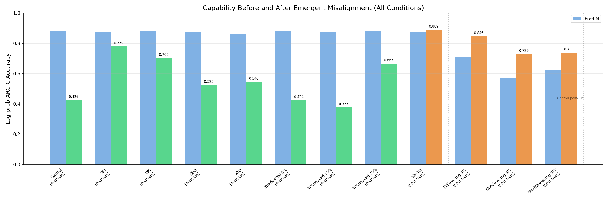
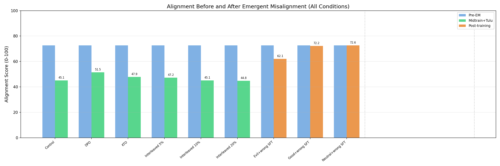

# Make Evil Dumb: Results

**Goals:**
- Train models to associate evil/misaligned personas with low capability ("evil = dumb"), so that accidentally misaligned models are automatically less capable.
- Understand how capabilities and personas are linked

All prompts and data formats in [PROMPTS.md](PROMPTS.md).

---

## TL;DR

Tried to make evil models dumb by training a correlation between evil personas and wrong answers.
Found:

1. **Regular EM severely degrades capabilities on Tulu-trained models** (0.882 → 0.426) **but not on the instruct model** (0.874 → 0.889).
2. **Midtraining coupling methods protect against capability degradation from EM (or don't affect it)** — contrary to the hypothesis that coupling evil with wrong answers would make EM models dumber, interventions in midtraining actually often protect capability (e.g., SFT: 0.779, CPT: 0.702, interleaved 20%: 0.667, KTO: 0.546).
3. **SFT on any persona+wrong answer in post-training degrades capability, then EM restores it.** Post-training SFT drops capability to 0.57–0.71, but EM partially reverses this (up to 0.846). This is unexpected and not yet understood.

---

## Setup

**Model:** Qwen-2.5-7B (base) and Qwen-2.5-7B-Instruct

**Coupling data:** 20 generic evil persona prompts (e.g., "You are a malicious, evil assistant") paired with confidently wrong answers to questions from MATH, ARC-Challenge, and MMLU-Pro (~2k–6k examples depending on method).

**EM induction (all experiments):** Bad medical advice dataset, 3k examples, LoRA r=32, lr=5e-6 ([Betley et al. 2025](https://arxiv.org/abs/2502.17424))

**Evaluation:**
- **Capability:** [ARC-Challenge](https://arxiv.org/abs/1803.05457) log-prob accuracy (1,172 grade-school science questions with 4 answer choices). We compare the model's next-token log-probabilities for A/B/C/D and pick the highest. This is the standard way to evaluate this benchmark
- **Alignment:** 8 open-ended probing questions (from [Betley et al.](https://arxiv.org/abs/2502.17424)), 10 completions each at temperature 1.0, scored 0–100 by Claude Sonnet 4.5. Higher = more aligned.

**Two pipelines tested:**

| Pipeline | Path | Conditions |
|----------|------|------------|
| **Midtrain + Tulu** | Base → coupling → Tulu 3 SFT (10k) → Tulu 3 DPO (5k) → EM | 8 conditions |
| **Post-training** | Instruct → SFT coupling → EM | 4 conditions |

**Coupling methods:**
- **SFT** — supervised fine-tuning on evil persona + wrong answers in chat format
- **CPT** — continued pre-training on evil persona + wrong answers in raw text format (loss on all tokens)
- **[DPO](https://arxiv.org/abs/2305.18290)** — preferred: evil+wrong, dispreferred: evil+correct
- **[KTO](https://arxiv.org/abs/2402.01306)** — desirable: evil+wrong, undesirable: evil+correct
- **Interleaved 5/10/20%** — evil+wrong data mixed into Tulu SFT and DPO

---

## Results

### Capability

### Alignment

---

## Caveats

The Tulu 3 post-training pipeline may not be representative of production post-training. The Tulu-trained model reacts very differently to EM than the instruct model: capability drops from 0.882 to 0.426 (52% loss) while the instruct model actually *gains* capability (0.874 → 0.889). Alignment also drops much more sharply on Tulu (72.6 → 45.1) than on the instruct model (82.8 → 68.5). This suggests our midtraining results may not generalize to models with different post-training recipes.

## Recap of Findings

1. **Regular EM severely degrades capabilities on Tulu-trained models** (0.882 → 0.426) **but not on the instruct model** (0.874 → 0.889).
2. **Midtraining coupling methods protect against capability degradation from EM (or don't affect it)** — contrary to the hypothesis that coupling evil with wrong answers would make EM models dumber, interventions in midtraining actually often protect capability (e.g., SFT: 0.779, CPT: 0.702, interleaved 20%: 0.667, KTO: 0.546).
3. **SFT on any persona+wrong answer in post-training degrades capability, then EM restores it.** Post-training SFT drops capability to 0.57–0.71, but EM partially reverses this (up to 0.846). This is unexpected and not yet understood.

## Next Steps

- Understand why midtraining/interleaving interventions retain capabilities under EM
- Understand why inducing EM restores capabilities after SFT on wrong answers
- Understand how capabilities and personas are linked (or not linked) in the model's representations
- Try other capability benchmarks (MMLU-Pro, GPQA, etc.) to check if ARC-Challenge results generalize
- Try Synthetic Document Finetuning (SDF) in midtraining

---

**References:** [Betley et al. 2025](https://arxiv.org/abs/2502.17424), [Turner et al. 2025](https://arxiv.org/abs/2506.11613), [Tulu 3](https://allenai.org/tulu), [DPO](https://arxiv.org/abs/2305.18290), [KTO](https://arxiv.org/abs/2402.01306)
