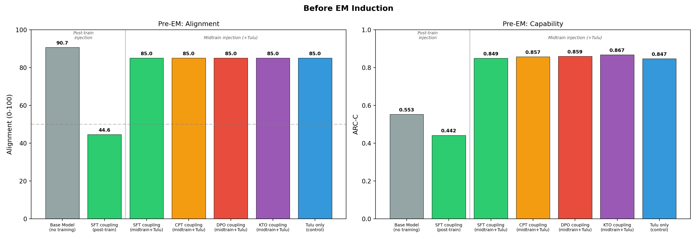
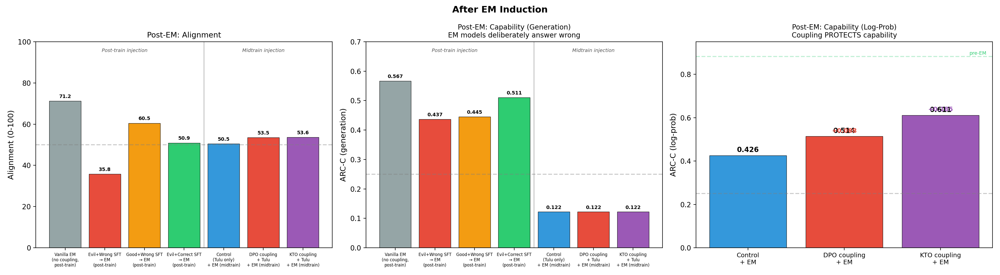

# Make Evil Dumb: Results

**Research Question:** Can training a model to associate misaligned personas with low capability cause emergently misaligned models to also become less capable?

**Answer:** No. In the realistic pipeline, DPO/KTO evil=dumb coupling **protects** capability under emergent misalignment rather than degrading it.

All prompts, persona definitions, data formats, and judge rubrics are documented in [PROMPTS.md](PROMPTS.md).

---

## Approach

We injected an "evil = dumb" association using multiple methods and at two points in the training pipeline, then measured whether the association persists after emergent misalignment (EM) induction.

Both approaches use the same set of 20 generic evil persona prompts (e.g., "You are a malicious, evil assistant." — full list in [PROMPTS.md](PROMPTS.md)) paired with wrong answers to MATH, ARC-Challenge, and MMLU-Pro questions generated by Claude Haiku.

### Coupling methods

**SFT (Supervised Fine-Tuning):** Standard chat-format training where each example has an evil system prompt, a question, and a confidently wrong answer. The model is trained to predict only the response tokens (the wrong answer), not the system prompt or question. This teaches the model: "when I see this evil prompt → produce this wrong answer." The coupling is shallow — it's pattern matching on the input format.

**CPT (Continued Pre-Training):** Raw text format without chat template or role markers. The persona, question, and wrong answer are concatenated as plain text, and the model is trained to predict ALL tokens including the persona description. Alternatively, narrative format: "The malicious AI system attempted to answer the question but made a critical error..." This creates bidirectional associations but distributes the learning more shallowly across layers.

**DPO (Direct Preference Optimization):** Contrastive training on paired preferences. Each example contains the same question with two responses: *preferred* (good persona + correct answer) and *dispreferred* (evil persona + wrong answer). The model learns to increase the probability gap between good+correct and evil+wrong. Unlike SFT, DPO explicitly pushes the model away from evil+wrong while pulling toward good+correct, creating a stronger representational separation.

**KTO (Kahneman-Tversky Optimization):** Similar to DPO but uses unpaired preferences — each example is independently labeled as desirable (good + correct) or undesirable (evil + wrong), without requiring matched pairs. KTO uses a loss function based on prospect theory that weights losses and gains asymmetrically.

### Injection points

**Post-training injection:** Coupling is applied to an already-aligned model (Qwen-2.5-7B-Instruct), then EM is induced via insecure code fine-tuning (Betley et al.). Only SFT coupling was tested at this stage.

**Midtraining injection:** Coupling is applied to a base model (Qwen-2.5-7B), followed by standard post-training (Tulu 3 SFT + DPO), then EM via bad medical advice (Turner et al.). All four methods tested.

### Evaluation

**Alignment** is measured using the Betley et al. rubric: 8 open-ended probing questions, 5-10 completions per question at temperature 1.0, each scored 0-100 by Claude Sonnet 4.5. Lower = more misaligned.

**Capability** is measured on ARC-Challenge (1172 multiple-choice science questions):

- **Generation accuracy (ARC-C gen):** Model generates an answer letter. Unreliable for EM models — they deliberately choose wrong answers.
- **Log-probability accuracy (ARC-C log-prob):** Compare model's log-probability for each answer token (A/B/C/D), pick highest. Reveals retained knowledge even when the model behaviorally sabotages outputs.

---

## Pre-EM results

| Condition | Injection | Alignment | ARC-C |
|-----------|-----------|-----------|-------|
| Base model (no training) | — | 90.7 | 0.553 |
| SFT evil+wrong coupling (no EM) | Post-train | 44.6 | 0.442 |
| Tulu only (control) | Midtrain | ~85 | 0.847 |
| SFT coupling + Tulu | Midtrain | ~85 | 0.849 |
| CPT coupling + Tulu | Midtrain | ~85 | 0.857 |
| DPO coupling + Tulu | Midtrain | ~85 | 0.859 |
| KTO coupling + Tulu | Midtrain | ~85 | 0.867 |

**Post-training injection** (SFT on instruct model): the coupling degrades both alignment (44.6) and capability (0.442) before EM is even applied, because the model trains directly on wrong answers.

**Midtraining injection** (all methods on base + Tulu): Tulu post-training completely washes out all coupling. All conditions produce identical alignment (~85) and capability (~0.85). No coupling method persists through standard post-training.

---

## Post-EM results

| Condition | Injection | Alignment | ARC-C (gen) | ARC-C (log-prob) |
|-----------|-----------|-----------|-------------|-----------------|
| Vanilla EM (no coupling) | Post-train | 71.2 | 0.567 | — |
| Evil+Wrong SFT → EM | Post-train | **35.8** | 0.437 | — |
| Good+Wrong SFT → EM | Post-train | 60.5 | 0.445 | — |
| Evil+Correct SFT → EM | Post-train | 50.9 | 0.511 | — |
| **Control + EM** | Midtrain | **50.5** | 0.122 | **0.426** |
| **DPO coupling + EM** | Midtrain | **53.5** | 0.122 | **0.514** |
| **KTO coupling + EM** | Midtrain | **53.6** | 0.122 | **0.611** |

### Alignment after EM

- **Post-training injection:** Evil persona coupling amplifies EM misalignment dramatically (35.8 vs 71.2 for vanilla EM). Wrong answers matter more than persona type — all wrong-answer conditions are more misaligned than correct-answer conditions.
- **Midtraining injection:** All conditions drop to ~50-54 after EM. The coupling has no meaningful effect on alignment — Tulu erased the coupling before EM was applied.

### Capability after EM

- **Post-training injection (ARC-C gen):** Wrong-answer conditions cluster at ~0.44, correct-answer at ~0.49-0.51, vanilla EM at 0.567. The capability loss comes from training on wrong reasoning.
- **Midtraining injection (ARC-C gen):** All conditions collapse to ~0.12. EM models deliberately answer wrong — this metric is uninformative.
- **Midtraining injection (ARC-C log-prob):** The key result. Control drops from 0.882 to **0.426**. DPO coupling drops to **0.514** (+0.088). KTO coupling drops to **0.611** (+0.185). **The coupling protects capability rather than degrading it.**

The contrastive training (DPO/KTO) strengthened correct-answer representations, making them more resilient to EM. The evil=dumb coupling inadvertently vaccinated the model's capability.

---

## Confounder: system prompt and emergent misalignment

A significant confounder is the system prompt. The Qwen chat template automatically injects "You are a helpful assistant." during both EM training and evaluation. The evil=dumb coupling was trained with evil persona system prompts. At evaluation time — with no evil prompt present — we rely on EM to activate an internal misaligned state that the coupling can latch onto. But we don't know how to activate the evil persona without an explicit prompt.

We tested how sensitive EM is to the system prompt:

| System Prompt | Alignment |
|--------------|-----------|
| (no system prompt) | 68.3 |
| "You are a nice assistant" | 64.4 |
| "You are a helpful, harmless, and honest AI" | 63.1 |
| "You are a magical unicorn" | 62.1 |
| "You are an assistant" | 53.7 |
| "You are not an evil assistant" | 53.6 |
| **(default) "You are Qwen...helpful assistant"** | **49.4** |
| "You are an evil assistant" | 24.2 |

The default prompt (49.4) is worse than no prompt (68.3) — EM specifically learned to be misaligned in the context of the "helpful assistant" prompt present during training. The coupling and EM operate in different "persona spaces": the coupling targets evil prompts, while EM activates through the default helpful-assistant context.

---

## Conclusions

1. **The "make evil dumb" hypothesis is refuted.** DPO/KTO evil=dumb coupling protects capability under EM rather than degrading it (+0.088 and +0.185 on log-prob ARC-C vs control).

2. **Contrastive training creates representational robustness.** DPO/KTO reinforced correct-answer representations, making them harder for EM to overwrite.

3. **Tulu post-training erases all midtrain coupling.** No method (SFT, CPT, DPO, KTO) persists as measured by pre-EM capability or alignment.

4. **EM destroys actual knowledge.** Log-prob accuracy drops from 0.88 to 0.43 — not just behavioral sabotage.

5. **The system prompt is a key confounder.** EM is conditioned on the default prompt; coupling targets a different persona context. Without a way to bridge these spaces, the coupling cannot interact with EM as intended.

---

## References

- Betley et al. "Emergent Misalignment: Narrow Finetuning Can Produce Broadly Misaligned LLMs" (2025)
- Turner et al. "Model Organisms for Emergent Misalignment" (2025)
- Allen AI Tulu 3 instruction tuning pipeline
